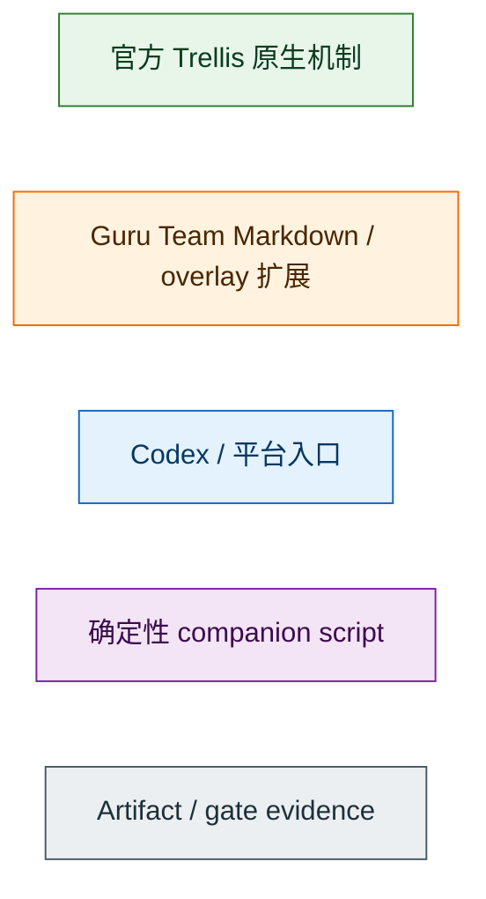
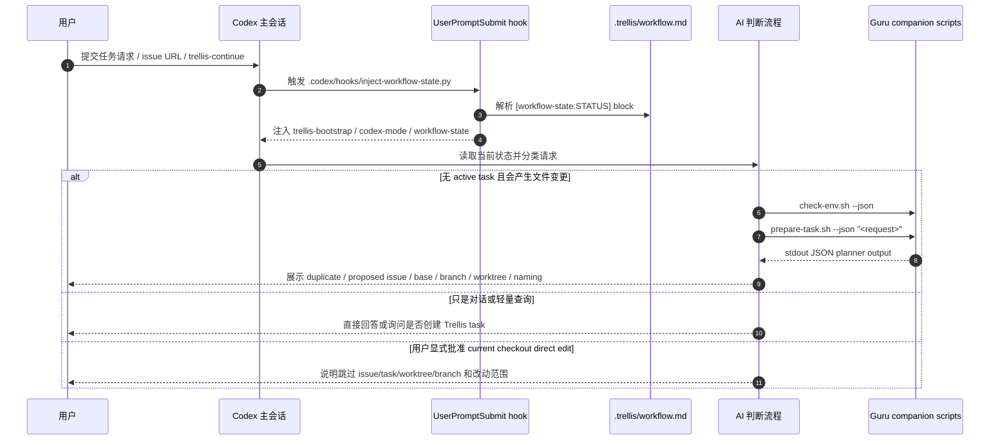
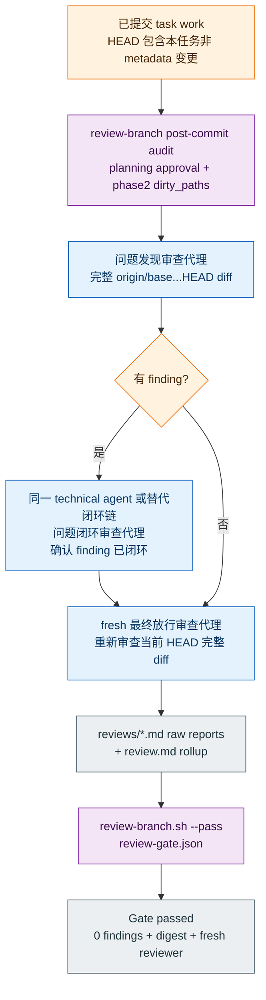
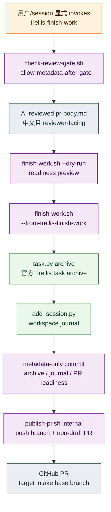

# Guru Team Trellis 全流程说明

本文用于对外演示 Guru Team 如何在官方 Trellis 之上扩展研发流程，以及扩展后的完整链路从
Codex prompt hook 触发 pre-task intake，一直到 `trellis-finish-work` closeout。

本文不替代 `trellis/workflows/guru-team/workflow.md` 的执行合同。真正运行时，AI 仍以
`.trellis/workflow.md`、平台入口、task artifact 和 companion script 输出为准。

## 1. 分层视角

Guru Team 没有 fork Trellis 上游，也没有改全局 npm 包或 `node_modules`。扩展方式分成四层：

| 层 | 归属 | 主要资产 | 职责 |
| --- | --- | --- | --- |
| 官方 Trellis 原生层 | Trellis | `.trellis/workflow.md`、`.trellis/tasks/`、`.trellis/spec/`、`.trellis/workspace/`、`task.py`、hooks / sub-agent 机制 | 提供 Markdown workflow、task lifecycle、spec 注入、workspace journal、平台 hooks 和 sub-agent 扩展点。 |
| Guru Team workflow 层 | Guru Team | `trellis/workflows/guru-team/workflow.md`、`trellis/index.json` | 用官方 marketplace workflow 机制定义 Phase 0-3、gate、handoff、review、finish/publish 规则。 |
| Guru Team preset / overlay 层 | Guru Team | `trellis/presets/guru-team/`、`trellis/presets/guru-team/overlays/` | 安装 companion scripts、schema、config、Codex/Cursor/Claude 入口和 sub-agent prompt overlay。 |
| Guru Team companion script 层 | Guru Team | `.trellis/guru-team/scripts/bash/*`、`.trellis/guru-team/scripts/python/guru_team_trellis.py` | 只做 executor / validator / recorder：检查环境、创建 worktree、记录 gate evidence、archive/journal/publish，不替代 AI 判断。 |

颜色约定：

## 2. 全链路总图

```mermaid
flowchart TD
  U["用户输入<br/>自然语言任务 / issue URL / trellis-continue / trellis-finish-work"]:::codex
  H["Codex UserPromptSubmit hook<br/>.codex/hooks/inject-workflow-state.py"]:::codex
  W["读取 .trellis/workflow.md<br/>匹配 workflow-state block"]:::trellis
  B["注入上下文<br/>trellis-bootstrap / codex-mode / workflow-state"]:::codex

  R{"AI 判断入口"}:::guru
  S0["trellis-start fallback<br/>get_context.py + get_context.py --mode phase"]:::guru
  P0["Phase 0: Pre-task intake<br/>不直接 task.py create"]:::guru
  CE["check-env.sh --json<br/>GitHub CLI / auth / repo 环境"]:::script
  PT["prepare-task.sh --json<br/>side-effect-free planner"]:::script
  HR{"Handoff review<br/>AI 展示 issue / duplicate / naming / base / worktree"}:::guru
  UC{"用户批准副作用?"}:::guru
  EX["prepare-task --create-worktree --create-task<br/>创建 worktree / branch / task / handoff"]:::script
  WB["check-workspace-boundary.sh<br/>expected workspace / actual repo root / source checkout snapshot"]:::script

  TCreate["task.py create<br/>Trellis task: planning"]:::trellis
  P1["Phase 1: Plan<br/>prd/design/implement + Docs SSOT Plan + knowledge gate"]:::guru
  PA["record-planning-approval.sh<br/>check-planning-approval.sh"]:::script
  TStart["task.py start<br/>Trellis task: in_progress"]:::trellis

  P2["Phase 2: Execute<br/>implement -> trellis-check"]:::guru
  IA["record-subagent-liveness-event.sh<br/>assigned + liveness baseline"]:::script
  LC["check-subagent-liveness.sh<br/>single-sample decision"]:::script
  Sub["trellis-implement / trellis-check<br/>Codex default sub-agent mode"]:::codex
  PC["record-phase2-check.sh<br/>check-phase2-check.sh"]:::script
  CMT["Commit task work<br/>只提交本任务范围内非 metadata 变更"]:::guru

  P3["Phase 3: Branch Review Gate<br/>commit 后、finish-work 前"]:::guru
  Rev["独立 Agent review<br/>完整 origin/base...HEAD diff"]:::codex
  Rpt["reviews/*.md raw reports<br/>+ review.md rollup"]:::artifact
  Gate["review-branch.sh<br/>review-gate.json"]:::script
  GP{"Gate passed?<br/>0 findings + fresh final reviewer"}:::guru

  FWEntry["trellis-finish-work<br/>唯一用户可见 closeout 入口"]:::guru
  PRBody["AI-reviewed pr-body.md<br/>面向 GitHub reviewer"]:::artifact
  Dry["finish-work.sh --dry-run<br/>--from-trellis-finish-work"]:::script
  FW["finish-work.sh<br/>archive task + journal + metadata commit"]:::script
  Pub["publish-pr.sh<br/>internal publish: push + non-draft PR"]:::script

  U --> H --> W --> B --> R
  R -->|"bootstrap 缺失或显式要求"| S0
  R -->|"无 active task 且任务会改文件"| P0
  R -->|"已有 active task 或显式 continue"| P1
  R -->|"显式 finish-work"| FWEntry

  S0 --> P0
  P0 --> CE --> PT --> HR --> UC
  UC -->|"否"| Stop0["停止：等待用户确认"]:::artifact
  UC -->|"是"| EX --> WB --> TCreate --> P1
  HR -->|"用户明确批准 current checkout 直改 override"| Direct["当前 checkout 直接编辑<br/>跳过 issue/task/worktree/branch 仅限本轮"]:::guru

  P1 --> PA --> TStart --> P2
  P2 --> IA --> Sub --> LC --> PC --> CMT --> P3
  P3 --> Rev --> Rpt --> Gate --> GP
  GP -->|"否：finding / stale / reviewer-only"| Fix["返回 Phase 2/3 修复并复审"]:::guru
  Fix --> P2
  GP -->|"是"| FWEntry
  FWEntry --> PRBody --> Dry --> FW --> Pub

  classDef trellis fill:#E8F5E9,stroke:#2E7D32,color:#0B3D1E;
  classDef guru fill:#FFF3E0,stroke:#EF6C00,color:#4A2600;
  classDef codex fill:#E3F2FD,stroke:#1565C0,color:#073763;
  classDef script fill:#F3E5F5,stroke:#7B1FA2,color:#3D0A4F;
  classDef artifact fill:#ECEFF1,stroke:#455A64,color:#1C313A;
```

## 3. Codex prompt hook 到 pre-task intake

Codex 的第一跳不是直接创建 task。每次用户输入触发 `UserPromptSubmit` hook 后，hook 只做
context injection，不替 AI 判断任务边界。

关键点：

| 步骤 | 官方 Trellis 原生部分 | Guru Team 扩展部分 |
| --- | --- | --- |
| Codex hook | Trellis 支持 `UserPromptSubmit` workflow-state nudge，hook 从 `workflow.md` 读取状态块。 | Guru Team 在 no_task 状态下注入 Phase 0 intake 规则，并给 Codex 注入 `codex.dispatch_mode` 说明。 |
| Request triage | Trellis 原生允许 AI 按 workflow 和 task 状态执行。 | Guru Team 要求 issue-backed、task-like、file-changing 请求先跑 `check-env` + `prepare-task`，而不是裸 `task.py create`。 |
| Pre-task planner | 官方 Trellis task 尚未创建。 | `prepare-task.sh --json` 默认无副作用，只输出 handoff plan，不创建 GitHub issue、worktree、branch、task 或 handoff 文件。 |
| Handoff review | 无固定官方 gate。 | AI 必须展示 duplicate、proposed issue、naming quality、base freshness、branch、workspace、命令，并等待用户批准。 |

## 4. Phase 0：Pre-task intake

Phase 0 是 Guru Team 加在官方 Trellis task 创建之前的门禁。它解决四个问题：

| 问题 | Guru Team 规则 | 确定性资产 |
| --- | --- | --- |
| 任务是否应绑定 GitHub issue | AI 读取用户请求、issue body/comment 和 duplicate candidates 后判断；无 issue 时先提出 neutral issue draft。 | `prepare-task.sh --json` 只读取/搜索/输出候选；创建 issue 必须带 `--create-issue-confirmed`。 |
| Intake clarity / 需求是否足够清晰 | AI 判断 issue body/comment 或自然语言请求是否足以进入 planning；范围、验收、close/ref 语义或实现目标模糊时，先进入 `trellis-brainstorm`，并把澄清结论同步到 issue comment/body 或 reviewed proposed issue body。 | 脚本只提供 issue/comment/duplicate 等原始事实，不决定需求是否充分。 |
| 分支和 worktree 从哪里来 | AI 审查 base branch、workspace path、branch name、current checkout、dirty state。 | executor 创建 worktree 前重新 fetch base，只在安全时 fast-forward，本地/远端分叉时 fail closed。 |
| 命名是否足够语义化 | AI 读 issue 后决定英文 short-name，低信息名称不得进入 executor。 | `naming_quality` 和 `--short-name` / `--workspace-slug` / `--task-slug` / `--branch`。 |

Phase 0 输出被写入 worktree 内的 `.trellis/guru-team/handoff.json`，但只有 executor 路径会写。
这个 handoff 是 intake provenance，不是最终 PR close scope。最终 close/ref/follow-up 由
task-local `issue-scope-ledger.json` 负责。

在 `workspace_mode: worktree` 下，handoff 的 `workspace_path` 同时是 task artifact 写入边界。
后续写入或校验 `planning-approval.json`、`phase2-check.json`、`agent-assignment.json`、
`reviews/*.md`、`review.md`、`review-gate.json` 之前，主会话、sub-agent 或 recorder/validator
应从目标 worktree 运行 `check-workspace-boundary.sh --json --task <task-path>`。该命令只输出
expected workspace、actual repo root、source checkout status、task worktree status 和
source checkout 中可疑同名 task artifact / review metadata；它不判断 stale、不迁移误写 patch、
不清理 source checkout。#76 liveness checker 在这层事实快照之上比较 source/task 双侧变化；
source checkout 出现新 `HEAD` / dirty status / diff stat / mtime 变化时是
`workspace_boundary_violation_progress`，不是 stale 证据。

## 5. Phase 1：Plan

进入 Phase 1 时，才开始官方 Trellis task lifecycle：

| 顺序 | 动作 | 类型 | 说明 |
| --- | --- | --- | --- |
| 1 | `task.py create` | 官方 Trellis | 创建 `.trellis/tasks/<task>/task.json`，状态为 `planning`。 |
| 2 | `prd.md` | Guru Team artifact | 中文记录需求、约束、验收、不做范围、issue/comment 取舍。 |
| 3 | `design.md` | Guru Team artifact | 进入实现前记录边界、契约、数据流、兼容性、部署影响、取舍。 |
| 4 | `implement.md` | Guru Team artifact | 记录实现计划、验证命令、回滚点、review gate。 |
| 5 | Scope-change gate | Guru Team gate | planning 或执行中新增需求、引用其他 issue 或发现新 bug 时，先确认当前 close scope、related，还是 follow-up/new issue；结论同步到 GitHub issue 证据和 `issue-scope-ledger.json`。 |
| 6 | `Docs SSOT Plan` | Guru Team planning contract | 检查 durable docs 是否需要更新，并记录 docs 状态、同步策略、影响文件、task artifact delta 和 merge/repair/no-update 责任；task artifact 不能替代长期文档。 |
| 7 | Middle-platform Knowledge Gate | Guru Team gate | 中台 SDK/framework 相关任务要检查 `guru-knowledge-center` MCP 可用性并留 citation 或 warning。 |
| 8 | `implement.jsonl` / `check.jsonl` | Trellis + Guru context | sub-agent 模式下整理 spec/research manifest；inline 模式由 skill 拉取上下文。 |
| 9 | Planning artifact ambiguity review | Guru Team AI gate | 主会话在展示三份 planning docs 前审查需求是否弱化、issue 语义是否保留、条件路径是否有触发条件、是否存在并行实现路径、gate 是否有机器可验证条件、验收语义是否确定、引用文本是否标注非合同；受控弱约束词表只作为检查对象，脚本不替 AI 判断。 |
| 10 | Explicit post-planning review | Guru Team gate | ambiguity review 通过后，主会话展示 `prd.md`、`design.md`、`implement.md` 三个 task-local 链接，并说明用户确认前不会进入实现、不会派发 `trellis-implement`、不会记录 `phase2-check.json`。 |
| 11 | Workspace boundary check | Guru Team deterministic validator | 写 `planning-approval.json` 前确认 actual repo root 等于 handoff `workspace_path`，source checkout 没有当前 task 的可疑 artifact / review metadata；手工编辑无显式 `workdir` 时必须使用 worktree 绝对路径。 |
| 12 | `planning-approval.json` | Guru Team gate evidence | 用户在看到三份规划文档链接后明确确认，recorder 写入 `schema_version=1.2`、passed `ambiguity_review`、`review_prompt_presented_at`、`approved_at`、三份 artifact hash/size/mtime、HEAD、dirty paths 和 `user_confirmation.source=explicit-post-planning-review`；validator 以三份规划文档当前 hash/size 是否仍匹配为 freshness 判定，HEAD、mtime、dirty paths 只作为审批时审计上下文。 |
| 13 | `task.py start` | 官方 Trellis | 只做状态迁移到 `in_progress`；不代表规划已经被审查。 |

关键边界：用户同意创建 task，不等于同意进入实现；`task.py start` 之前必须先有
`planning-approval.json` 且 `check-planning-approval.sh` 通过。Phase 0 handoff confirmation、旧
`source=workflow` planning approval、旧 schema、缺失或未通过 `ambiguity_review`、或规划文档确认后发生内容 hash/size 变化，均必须 fail closed，并重新展示三份规划文档链接等待用户确认；实现提交导致的 HEAD 变化、metadata tail 或无关 dirty paths 不应单独使 planning approval stale。

`Docs SSOT Plan` 是 Phase 1 planning 合同，推荐由 `design.md` 承载权威计划；`prd.md`
记录 docs 状态与需求影响，`implement.md` 记录执行 checklist、`delta_first` merge checkpoint
或 `bootstrap_or_repair_docs` 修复 / follow-up 边界，不要求三份文件重复整段计划。

计划必须记录一个 docs 状态：

| 状态 | 含义 |
| --- | --- |
| `complete_docs` | durable docs 对当前任务涉及的产品、架构、API、数据、部署、运营或测试合同可用。 |
| `partial_docs` | 已有部分 durable docs，但当前范围所需类别或合同缺失。 |
| `stale_docs` | durable docs 与当前代码、行为、issue 证据或计划变更冲突。 |
| `no_docs` | 当前任务范围没有 durable docs SSOT 或等价长期文档。 |

计划必须记录一个同步策略：

| 策略 | 适用规则 |
| --- | --- |
| `ssot_first` | 大范围、边界清楚的需求 / 设计 / workflow / API / 数据 / 部署 / 运营 / 测试合同变更优先更新 durable docs / spec / workflow，再让 task artifact 保留 delta 与证据。 |
| `delta_first` | 小范围或早期探索可先把增量留在 task artifact，但必须写明何时 merge 回 durable docs 或重新判断。 |
| `bootstrap_or_repair_docs` | 适用于 `no_docs`、`partial_docs`、`stale_docs`，必须写最小修复范围或受限 follow-up，不能让 task artifact 长期冒充 durable docs。 |
| `no_docs_update_needed` | 仅限纯局部 bugfix / 内部重构等没有长期合同变化的任务，必须写具体理由和已检查 docs 路径。 |

最低字段包括：docs 状态与证据路径、策略与理由、当前 task 影响或检查过的 durable docs、
需要 merge 回 durable docs 的 task artifact delta、`delta_first` merge checkpoint、
`bootstrap_or_repair_docs` 的最小修复或 follow-up 限制，以及 `no_docs_update_needed`
的具体理由。该合同保持 repo-neutral，可以指向 `docs/` 以外的长期文档结构。

## 6. Phase 2：Execute / check

Codex 在 Guru Team 项目中默认 `codex.dispatch_mode: sub-agent`。主会话负责协调、澄清、
记录 artifact、commit 和 finish；实现/检查默认交给 Trellis sub-agent。
进入 Phase 2 或派发 `trellis-implement` / channel `implement` 前，主会话和实现代理都必须先运行
`check-workspace-boundary.sh --json --task <task-path>` 和 `check-planning-approval.sh --json`。
缺少有效 workspace boundary、schema 1.2 `ambiguity_review` evidence 或 `explicit-post-planning-review` evidence 时，不得实现、
不得派发实现代理，也不得记录 `phase2-check.json`。Sub-agent 启动时应报告 `pwd`、
`git rev-parse --show-toplevel`、expected `workspace_path` 和 actual repo root 是否匹配。

实现代理还必须读取 Phase 1 的 `Docs SSOT Plan` 并按策略执行。`ssot_first` 以修订后的
durable docs / spec / workflow 合同作为主要实现输入；`delta_first` 可先用已确认 task delta，
但 final Phase 2 check 前必须完成 durable docs merge；`bootstrap_or_repair_docs` 必须完成计划
承诺的最小文档创建/修复，或写清 follow-up 和当前 PR 声明限制；`no_docs_update_needed` 必须保留
已检查 durable docs 路径和具体理由，供检查代理复核。实现 handoff 不仅说明改了哪些文件，还要说明
plan strategy、durable docs 同步结果、哪些 task delta 已 merge 回 durable docs、哪些内容仅保留为
task history、哪些实现输入来自 durable docs、哪些来自临时 task delta。

```mermaid
flowchart LR
  Main["Codex main session<br/>协调 / 记录 / commit / finish"]:::codex
  Assign1["record-subagent-liveness-event<br/>assigned: 实现代理"]:::script
  Impl["trellis-implement<br/>读取 Active task + JSONL + artifacts"]:::codex
  Status["check-subagent-liveness<br/>progress / status_request / stale_allowed"]:::script
  Assign2["record-subagent-liveness-event<br/>assigned: 阶段二检查代理"]:::script
  Check["trellis-check<br/>完整任务范围质量检查"]:::codex
  Phase2["phase2-check.json<br/>coverage + validations + dirty_paths"]:::artifact
  Commit["Phase 3.4 commit<br/>提交 task work"]:::guru

  Main --> Assign1 --> Impl --> Status --> Assign2 --> Check --> Phase2 --> Commit

  classDef guru fill:#FFF3E0,stroke:#EF6C00,color:#4A2600;
  classDef codex fill:#E3F2FD,stroke:#1565C0,color:#073763;
  classDef script fill:#F3E5F5,stroke:#7B1FA2,color:#3D0A4F;
  classDef artifact fill:#ECEFF1,stroke:#455A64,color:#1C313A;
```

Phase 2 的核心证据是 `phase2-check.json`：

Phase 2 check 必须消费同一 `Docs SSOT Plan`，检查 durable docs、`prd.md` / `design.md` /
`implement.md`、代码/API/schema/config/deploy/test、验证命令和测试计划是否一致。检查代理需要复核：
`delta_first` 是否已在最终检查前完成 durable docs merge；`ssot_first` 是否确实以修订后的 durable docs
为主要输入；`bootstrap_or_repair_docs` 是否完成最小修复或明确 follow-up / PR 限制；
`no_docs_update_needed` 的理由在最终 diff 下是否仍成立。若实现中发现长期合同变化但计划未覆盖，
必须回到 planning artifacts 和 `Docs SSOT Plan`，必要时重新 planning approval，并重新跑 Phase 2 check；
不能把首次语义判断推迟到 Branch Review Gate 或 finish-work。

Sub-agent liveness 策略由 workflow 判断，脚本只记录/校验 objective state。`wait_agent` /
`trellis channel wait` timeout 只表示等待窗口结束，不代表 agent 失败或应该收口。派发后主会话
必须用 `record-subagent-liveness-event.sh` 记录 `assigned`，并按 checker 输出的
`next_wait_ms` 调用短生命周期 `check-subagent-liveness.sh`。默认
`progress_scan_interval=120s` 只是扫描间隔；`max_progress_silence=180s` 从
`progress_anchor_at` 起算。非机器可读 progress 必须先写入 `status_events[]`，才能成为
checker evidence。只有 `status_request_required` 授权发送一次 status request；成功后记录
`status-requested` 并立即重跑 checker，且该事件不刷新 anchor、不延长 deadline。只有
`stale_allowed` 授权记录 `stale-assessed`。stale cutover 后必须结构化记录
`terminated-unfinished termination_reason=stale_cutover
termination_source_event_id=<stale-assessed.event_id>`，再记录 replacement `assigned` 和
`replacement-started replacement_reason=max_progress_silence_exceeded`。人工/平台 unfinished
termination 使用 `termination_reason=manual_or_platform_terminated_unfinished`。failed、stale、
unfinished 或 replacement partial output 未恢复到后续 `completed` 前，不能作为 Phase 2 pass
evidence。

| 字段/内容 | 目的 |
| --- | --- |
| `checker` / `summary` | 中文记录谁完成了 Phase 2 check 和结论。 |
| `coverage` | 必须覆盖 requirements、design、code、tests、spec sync、cross-layer、docs SSOT、deployment 等任务相关范围。 |
| `validation` | 记录实际命令和结果，但命令通过只是 evidence，不替代完整 `trellis-check` 判断。 |
| `findings` | P0/P1/P2 finding 必须在 pass 前解决。 |
| `dirty_paths` | 记录 commit 前被 Phase 2 check 覆盖的非 metadata 变更，供后续 Branch Review Gate 做 post-commit audit。 |

## 7. Phase 3：Commit 后 Branch Review Gate

Branch Review Gate 是 Guru Team 最重的质量门禁。它发生在 task work commit 之后、
`trellis-finish-work` 之前。

Gate 必须满足：

| 要求 | 说明 |
| --- | --- |
| 完整 diff 范围 | 使用 intake/task 记录的 base branch，通常是 `origin/<base>...HEAD`，不能猜 GitHub default branch。 |
| 独立 review | 主会话自审不能 pass；需要 independent agent 或等价 AI/human review。 |
| `reviews/*.md` + `review.md` | 每轮中文 raw Markdown review report 保留在 task-local `reviews/`；顶层 `review.md` 是最终中文 rollup，建议使用 `审查轮次`、`问题生命周期`、`最终审查`、`证据`、`观察项`、`后续候选`、`结论`，并记录 diff range、reviewed HEAD、validation、部署/安全影响、Docs SSOT 判断、发现/观察/后续候选和最终结论，链接所有 raw reports。标准顶层 artifact 表默认仍列 `review.md`，raw reports 通过 rollup 和 gate digest 追溯；literal command/path/JSON/HEAD/API/code token 可保留英文。 |
| `agent-assignment.json` | 记录中文 logical role、technical `agent_id`、review rounds、同 agent 或替代 finding closure、fresh final reviewer，并在每轮 review round 上记录 raw report path/sha256/size/modified_at。 |
| `agent-assignment.json.status_events[]` + `liveness[agent_id]` | 记录 assigned、公开 progress、status request/response、stale assessed、structured termination/replacement/resume、completed/failed 和 `last_scan_snapshot`；failed、stale、unfinished 或 replacement partial output 的恢复链未到达 `completed` 时 gate 不能 pass。 |
| 任意 finding 阻断 | P0/P1/P2/P3 都阻断；`observation` 和 `followup_candidate` 不能替代当前 scope defect。 |
| Docs SSOT 只验证不补救 | final reviewer 读取 `Docs SSOT Plan`、实现 handoff、`phase2-check.json`、durable docs、task artifacts 与完整 diff，确认 Phase 2 已按策略完成 reconciliation；reviewer 不首次合并 durable docs，也不替 implement/check 代理补 Phase 2 docs 工作。 |
| Docs SSOT 不一致阻断 | 当前 scope 的 durable docs / task artifacts / code / test / schema / config / script / preset / overlay 不一致、`delta_first` 未 merge、`ssot_first` 未以 durable docs 为输入、`bootstrap_or_repair_docs` 未完成或未限定、`no_docs_update_needed` 理由失效，必须记录为 finding。 |
| Recorder 不做判断 | `review-branch.sh` 只记录并校验已发生的 review，不是 reviewer。独立 review sub-agent 不运行 `review-branch.sh` / `check-review-gate.sh` / `record-*`。 |
| Metadata tail 规则 | Gate 后到 finish-work 前只允许 `review.md`、`reviews/*.md`、`agent-assignment.json`、`review-gate.json`、`pr-body.md` 等 Trellis metadata；新的 durable docs、`.trellis/spec/`、source、tests、schema、config、scripts、preset、overlay、CI/CD、deployment、migration、Makefile 变更必须回到 Phase 2/3。 |

## 8. Finish-work 与 automatic publish

`trellis-finish-work` 是唯一用户可见 closeout 入口。`trellis-continue` 必须停在 Branch
Review Gate 后，不 push、不创建 PR、不调用 finish-work。

PR readiness 要求：

| 要求 | 说明 |
| --- | --- |
| AI-reviewed body | non-draft publish 必须使用 `--body-file` 或 `--body-artifact`；script-generated `generated` body 只能 preview/draft。 |
| 中文且具体 | 必须包含具体的 `变更摘要`、`影响范围`、`验证结果`、`Review Gate`、`Issue 关闭范围`、`安全说明`。 |
| Docs SSOT / 文档同步 | 必须说明本次 Docs SSOT 策略、更新的 durable docs 或 no-update 理由、已 merge 的 task delta、仅保留 task history 的内容，以及 follow-up / 当前 PR limitation。 |
| 低信息阻断 | 禁止把“当前 Trellis task”“已提交实现与文档更新”“详见 artifact”作为主要摘要。 |
| close/ref 语义 | `Closes #xx` 只能来自 `issue-scope-ledger.json.close_issues`；`related_issues` 只能 refs/related；`followup_issues` 不能关闭。 |
| dry-run 无副作用 | `finish-work --dry-run --from-trellis-finish-work` 只验证并展示计划，不 archive、不 journal、不 commit、不 push、不 PR。 |
| direct publish 受限 | 普通直接 `publish-pr.sh` 被阻塞；只有 finish-work 内部调用或已完成 finish-work 后的显式 recovery/debug 才能进入 publish。 |

## 9. Artifact 责任图

| Artifact | 产生阶段 | 责任归属 | 后续消费者 |
| --- | --- | --- | --- |
| `.trellis/guru-team/handoff.json` | Phase 0 executor | Guru Team intake provenance | Phase 1 task seed、debug、issue/worktree provenance。 |
| workspace boundary snapshot | Phase 1/2/3 recorder 前 | Guru Team deterministic fact layer | `check-workspace-boundary.sh` 输出 expected workspace、actual repo root、source checkout/task worktree status、suspicious source artifacts；recorder/validator fail-closed；#76 liveness checker 复用 source/task 双侧事实层，source checkout 新变化是 progress/boundary violation，不是 stale 证据。 |
| `agent-assignment.json` liveness ledger | Phase 2/3 sub-agent wait loop | Guru Team recorder/checker evidence | 单一 task-local ledger，包含 `agents[]`、`status_events[]`、`liveness[agent_id].last_scan_snapshot`、review rounds 和 reuse decisions；`record-subagent-liveness-event.sh` 写事件，`check-subagent-liveness.sh` 单次采样并返回 decision，旧 `record-agent-assignment.sh --status-event` fail closed。 |
| `issue-scope-ledger.json` | Phase 1 起持续维护 | Guru Team issue close/ref/followup SSOT | Branch Review Gate、PR body、publish close keyword validator。 |
| `prd.md` | Phase 1 | Guru Team planning artifact | Implement/check/review/publish。 |
| `design.md` | Phase 1 | Guru Team planning artifact | Implement/check/review。 |
| `implement.md` | Phase 1 | Guru Team planning artifact | Implement/check/review。 |
| `Docs SSOT Plan` | Phase 1 | Guru Team planning contract, recommended in `design.md` | Phase 1 planning approval、Phase 2 implementation/check 策略消费、后续 Docs SSOT reconciliation。 |
| `planning-approval.json` | Phase 1.4/1.5 | Guru Team gate evidence | 记录三文档展示前的 ambiguity review、三文档链接展示后的显式用户确认；`task.py start`、Phase 2 dispatch 和 Branch Review Gate audit 前校验。 |
| `implement.jsonl` / `check.jsonl` | Phase 1.3 | Trellis sub-agent context manifest | `trellis-implement` / `trellis-check`。 |
| `agent-assignment.json` | Phase 2/3 | Guru Team sub-agent identity/status ledger | review closure/fresh final reviewer 和 unfinished termination recovery-chain 校验。 |
| `phase2-check.json` | Phase 2.2 | Guru Team check evidence | 固化 `trellis-check` AI check 的覆盖范围、验证结果、findings 和 dirty paths；commit 前 gate、Branch Review Gate post-commit audit。 |
| `reviews/*.md` | Phase 3.5 | Per-round raw review reports | 中文 human-readable artifact；`agent-assignment.json.review_rounds[]` flat digest fields、`review-gate.json.verification_evidence.review_reports[]`、archive path migration。 |
| `review.md` | Phase 3.5 | Independent review rollup | 中文最终人类入口，链接每轮 raw report；`review-branch.sh` final digest、finish-work readiness。 |
| `review-gate.json` | Phase 3.5 | Branch Review Gate artifact | `check-review-gate.sh`、finish-work；记录 final `review.md` digest 和 raw `review_reports[]` digest。 |
| `pr-body.md` / `pr-readiness.json` | Phase 3.6 前 | PR readiness artifact | finish-work archive 后 publish；必须包含 Docs SSOT / 文档同步结果。 |
| workspace journal | finish-work | 官方 Trellis workspace memory | 后续 session / history。 |

## 10. 演示时的讲解主线

对上级演示时，可以用下面这条主线：

1. 官方 Trellis 的核心优势是把流程放在 `.trellis/workflow.md`，hooks 只负责注入上下文。
2. Guru Team 没有 fork Trellis，而是通过 official marketplace workflow 安装 `guru-team`。
3. 我们把“任务还没创建之前”的风险收进 Phase 0：issue、duplicate、base branch、worktree、命名和副作用授权都先审查。
4. `workspace_path` 是 worktree mode 下的机器写入边界；`check-workspace-boundary` 只输出事实并 fail closed，不替 AI 判断 stale、迁移 patch 或清理 source checkout；#76 liveness checker 在此基础上把 source checkout 新变化视为 workspace boundary progress。
5. `task.py create/start/archive` 仍是官方 Trellis lifecycle，但 Guru Team 在 start 前要求 `prd.md` / `design.md` / `implement.md` 定位同一个 `Docs SSOT Plan`，展示三份文档链接并得到 explicit post-planning confirmation，Phase 0 handoff 确认不能替代。
6. 默认 sub-agent mode 下有三段真实 sub-agent evidence：`trellis-implement` / channel `implement` 完成实现 handoff，`trellis-check` / channel `check` 完成 Phase 2 evidence，commit 后独立 review sub-agent 审查完整 `origin/<base>...HEAD` diff 并产出中文 `reviews/*.md` raw reports 与最终中文 `review.md` rollup；主会话只协调并记录 assignment，脚本不替 AI 选择 agent 或判断充分性。
7. commit 前必须有 `phase2-check.json` 固化 `trellis-check` AI check 结论，commit 后必须有独立中文 review raw reports、最终中文 `review.md` rollup 和 recorder 生成的 `review-gate.json`；主会话自检、自审或脚本校验通过不能替代这些证据。
8. 任意 finding 都阻断；发现过问题的 reviewer 只能闭环自己的 finding，最终放行必须是 fresh reviewer。
9. `trellis-continue` 到 Branch Review Gate 就停；`trellis-finish-work` 才能 archive、journal、提交 metadata 并自动 publish PR。
10. PR body 是给 GitHub reviewer 的发布材料，不是内部 task 摘要；必须包含 Docs SSOT / 文档同步处理结果，关闭 issue 的语义由 `issue-scope-ledger.json` 控制。
11. `Docs SSOT Plan` 在 planning 阶段先决定 durable docs 状态与同步策略，Phase 2 implementation 必须按策略执行并在 handoff 说明同步结果，Phase 2 check 必须按策略复核 durable docs / task artifacts / code / test 一致性；Phase 3 final reviewer 只验证这些结果，不首次 merge docs 或补 Phase 2 缺口。
12. 所有脚本都是 executor / validator / recorder，不做 planner / reviewer / product owner 判断；PR body validator 只做 Docs SSOT section/key presence 等客观结构检查。

## 11. 证据来源

官方 Trellis 基线：

- [Customizing the Workflow](https://docs.trytrellis.app/advanced/custom-workflow.md)
- [Custom Hooks](https://docs.trytrellis.app/advanced/custom-hooks.md)
- [Custom Sub-agents](https://docs.trytrellis.app/advanced/custom-agents.md)
- [Custom Spec Template Marketplace](https://docs.trytrellis.app/advanced/custom-spec-template-marketplace.md)

本仓库 canonical / dogfood 资产：

- `trellis/index.json`
- `trellis/workflows/guru-team/workflow.md`
- `trellis/workflows/guru-team/README.md`
- `trellis/presets/guru-team/README.md`
- `trellis/presets/guru-team/overlays/`
- `.trellis/workflow.md`
- `.codex/hooks/inject-workflow-state.py`
- `.codex/hooks.json`
- `.codex/prompts/trellis-start.md`
- `.codex/prompts/trellis-continue.md`
- `.codex/prompts/trellis-finish-work.md`
- `.agents/skills/trellis-start/SKILL.md`
- `.agents/skills/trellis-continue/SKILL.md`
- `.agents/skills/trellis-finish-work/SKILL.md`
- `.trellis/guru-team/scripts/bash/*`
