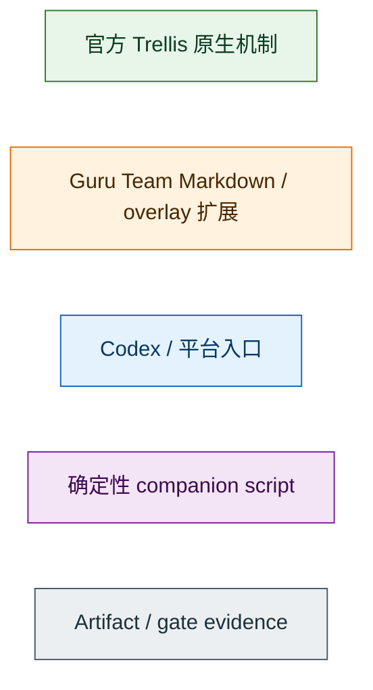
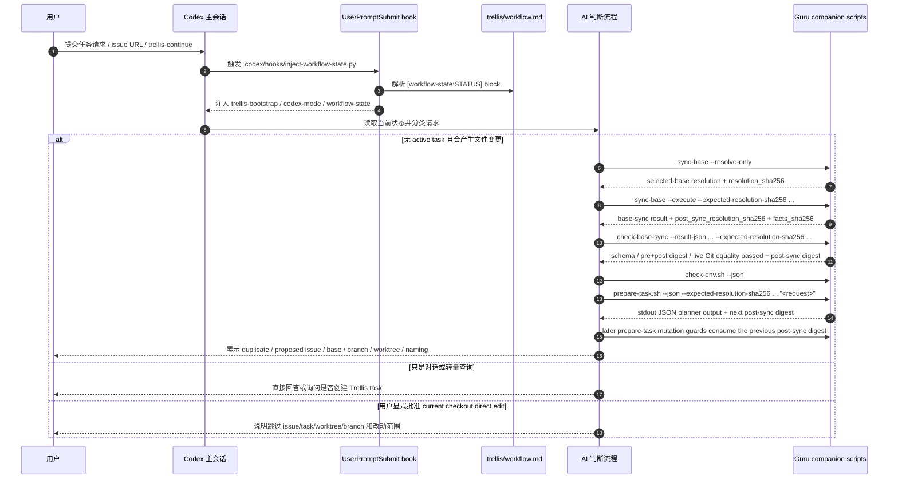
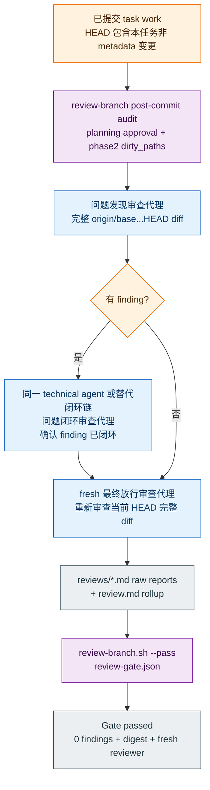
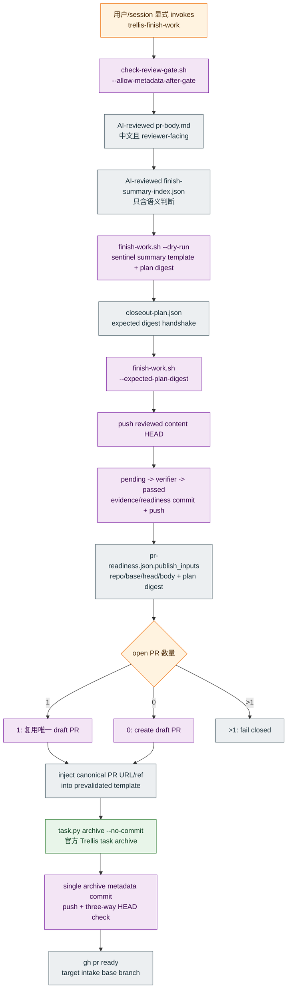

# Guru Team Trellis 全流程说明

本文用于对外演示 Guru Team 如何在官方 Trellis 之上扩展研发流程，以及扩展后的完整链路从
Codex prompt hook 触发 pre-task intake，一直到 `trellis-finish-work` closeout。

本文不替代 `trellis/workflows/guru-team/workflow.md` 的执行合同。真正运行时，AI 仍以
`.trellis/workflow.md`、平台入口、task artifact 和 companion script 输出为准。

## 1. 分层视角

Guru Team 没有 fork Trellis 上游，也没有改全局 npm 包或 `node_modules`。扩展方式分成四层：

| 层 | 归属 | 主要资产 | 职责 |
| --- | --- | --- | --- |
| 官方 Trellis 原生层 | Trellis | `.trellis/workflow.md`、`.trellis/tasks/`、`.trellis/spec/`、`.trellis/workspace/`、`task.py`、hooks / sub-agent 机制 | 提供 Markdown workflow、task lifecycle、spec 注入、workspace journal、平台 hooks 和 sub-agent 扩展点。 |
| Guru Team workflow 层 | Guru Team | `trellis/workflows/guru-team/workflow.md`、`trellis/index.json` | 用官方 marketplace workflow 机制定义 Phase 0-3、gate、handoff、review、finish/publish 规则。 |
| Guru Team preset / overlay 层 | Guru Team | `trellis/presets/guru-team/`、`trellis/presets/guru-team/overlays/` | 安装 companion scripts、schema、config、Codex/Cursor/Claude 入口和 sub-agent prompt overlay。 |
| Guru Team companion script 层 | Guru Team | `.trellis/guru-team/scripts/bash/*`、`.trellis/guru-team/scripts/python/guru_team_trellis.py` | 只做 executor / validator / recorder：检查环境、创建 worktree、记录 gate evidence、archive/finish-summary/readiness/publish，不替代 AI 判断。 |

颜色约定：

## 2. 全链路总图

公共 mandatory step 采用两层 SSOT：global workflow 通过可解析的
`guru-skill-invoke` / `guru-skill-exit` marker 拥有调用与出口路由；active
package 按 interface schema 1.2 的 `judgment_mode` 独占完整闭环：semantic 使用
“正向行为 -> AI Review Gate -> 条件 human confirmation -> recorder/validator -> typed
exit”，deterministic 使用“正向行为 -> recorder/validator -> typed exit”。Auto-trigger 只辅助发现，不能
替代 mandatory marker。任何 missing/unknown/multiple/unmapped exit 都必须
fail closed。

Workflow marketplace 不分发 external skill。Guru Team preset 在 source
validation 通过后，从 `trellis/skills/guru-team/` 安装 audited registry 和
active packages，并只为 selected platforms 生成 runtime discovery copy。

```mermaid
flowchart TD
  U["用户输入<br/>自然语言任务 / issue URL / trellis-continue / trellis-finish-work"]:::codex
  H["Codex UserPromptSubmit hook<br/>.codex/hooks/inject-workflow-state.py"]:::codex
  W["读取 .trellis/workflow.md<br/>匹配 workflow-state block"]:::trellis
  B["注入上下文<br/>trellis-bootstrap / codex-mode / workflow-state"]:::codex

  R{"AI 判断入口"}:::guru
  SB["mandatory guru-sync-base<br/>resolve -> execute -> validate -> typed exit<br/>deterministic stdout facts"]:::guru
  BS["sync-base / check-base-sync<br/>digest-bound fetch + ff-only + 3-way equality"]:::script
  S0["trellis-start fallback<br/>phase + packages + current task + Git facts"]:::guru
  P0["Phase 0: Pre-task intake<br/>不直接 task.py create"]:::guru
  DC["mandatory guru-discover-change-context<br/>current state -> history -> semantic evidence gate"]:::guru
  CR["mandatory guru-clarify-requirements<br/>evidence -> one-question loop -> exact confirmation"]:::guru
  CE["check-env.sh --json<br/>GitHub CLI / auth / repo 环境"]:::script
  PT["prepare-task.sh --json<br/>side-effect-free planner"]:::script
  HR{"Handoff review<br/>AI 展示 issue / duplicate / naming / base / worktree"}:::guru
  UC{"用户批准副作用?"}:::guru
  EX["prepare-task --create-worktree --create-task<br/>创建 worktree / branch / task / handoff"]:::script
  WB["check-workspace-boundary.sh<br/>expected workspace / actual repo root / source checkout snapshot"]:::script

  TCreate["task.py create<br/>Trellis task: planning"]:::trellis
  P1["Phase 1: Plan<br/>prd/design/implement + Docs SSOT Plan + knowledge gate"]:::guru
  PA["record-planning-approval.sh<br/>check-planning-approval.sh"]:::script
  TStart["task.py start<br/>Trellis task: in_progress"]:::trellis

  P2["Phase 2: Execute<br/>implement -> trellis-check"]:::guru
  IA["record-subagent-liveness-event.sh<br/>assigned + liveness baseline"]:::script
  LC["check-subagent-liveness.sh<br/>single-sample decision"]:::script
  Sub["trellis-implement / trellis-check<br/>Codex default sub-agent mode"]:::codex
  PC["record-phase2-check.sh<br/>check-phase2-check.sh"]:::script
  CMT["Commit task work<br/>只提交本任务范围内非 metadata 变更"]:::guru

  P3["Phase 3: Branch Review Gate<br/>commit 后、finish-work 前"]:::guru
  Rev["独立 Agent review<br/>完整 origin/base...HEAD diff"]:::codex
  Rpt["reviews/*.md raw reports<br/>+ review.md rollup"]:::artifact
  Gate["review-branch.sh<br/>review-gate.json"]:::script
  GP{"Gate passed?<br/>0 findings + fresh final reviewer"}:::guru

  FWEntry["trellis-finish-work<br/>唯一用户可见 closeout 入口"]:::guru
  PRBody["AI-reviewed pr-body.md<br/>+ finish-summary-index.json"]:::artifact
  Dry["finish-work.sh --dry-run<br/>--from-trellis-finish-work"]:::script
  FW["finish-work.sh<br/>immutable plan + draft + archive transaction"]:::script
  Pub["publish-pr.sh<br/>compatibility-only fail closed"]:::script

  U --> H --> W --> B --> R
  R -->|"bootstrap 缺失或显式要求"| S0
  R -->|"无 active task 且任务会改文件"| SB --> BS -->|"synced"| P0
  SB -->|"skipped"| SkipRoute["original non-repo route"]:::guru
  SB -->|"blocked"| StopBase["停止：base sync blocked"]:::artifact
  R -->|"已有 active task 或显式 continue"| P1
  R -->|"显式 finish-work"| FWEntry

  S0 --> P0
  P0 --> DC --> CR -->|"clear"| CE --> PT --> HR --> UC
  DC -->|"refresh_base"| SB
  CR -->|"needs_context"| DC
  CR -->|"refresh_context"| SB
  CR -->|"new_task"| NewTaskRoute["staged full task intake route"]:::guru
  CR -->|"blocked"| StopClarify["停止：requirements clarification blocked"]:::artifact
  UC -->|"否"| Stop0["停止：等待用户确认"]:::artifact
  UC -->|"是"| EX --> WB --> TCreate --> P1
  HR -->|"用户明确批准 current checkout 直改 override"| Direct["当前 checkout 直接编辑<br/>跳过 issue/task/worktree/branch 仅限本轮"]:::guru

  P1 --> PA --> TStart --> P2
  P2 --> IA --> Sub --> LC --> PC --> CMT --> P3
  P3 --> Rev --> Rpt --> Gate --> GP
  GP -->|"否：finding / stale / reviewer-only"| Fix["返回 Phase 2/3 修复并复审"]:::guru
  Fix --> P2
  GP -->|"是"| FWEntry
  FWEntry --> PRBody --> Dry --> FW
  Pub -->|"固定拒绝并指向"| FWEntry

  classDef trellis fill:#E8F5E9,stroke:#2E7D32,color:#0B3D1E;
  classDef guru fill:#FFF3E0,stroke:#EF6C00,color:#4A2600;
  classDef codex fill:#E3F2FD,stroke:#1565C0,color:#073763;
  classDef script fill:#F3E5F5,stroke:#7B1FA2,color:#3D0A4F;
  classDef artifact fill:#ECEFF1,stroke:#455A64,color:#1C313A;
```

## 3. Codex prompt hook 到 pre-task intake

Codex 的第一跳不是直接创建 task。每次用户输入触发 `UserPromptSubmit` hook 后，hook 只做
context injection，不替 AI 判断任务边界。

关键点：

| 步骤 | 官方 Trellis 原生部分 | Guru Team 扩展部分 |
| --- | --- | --- |
| Codex hook | Trellis 支持 `UserPromptSubmit` workflow-state nudge，hook 从 `workflow.md` 读取状态块。 | Guru Team 在 no_task 状态下注入 Phase 0 intake 规则，并给 Codex 注入 `codex.dispatch_mode` 说明。 |
| Request triage | Trellis 原生允许 AI 按 workflow 和 task 状态执行。 | Guru Team 要求 issue-backed、task-like、file-changing 请求的 first hop 是 `guru-sync-base`；只有 `synced` 后才运行 `check-env` + `prepare-task`。`skipped` 仅限 tool-free classification 已证明无需 repo/network action 的 workflow route，不得裸 `task.py create`。 |
| Base sync closed loop | 官方 Trellis 不替 Guru Team 选择或刷新业务 base。 | Tool-free route 后 mandatory invoke deterministic `guru-sync-base`；repo-changing route 只有在 pre-sync digest-bound executor 生成 post-sync digest且 validator 证明双 digest 与三方 equality 后才继续。Resolution/result facts 只走 stdout；`prepare-task` 每个 planner/mutation guard 消费上一 guard 的 post-sync digest并输出下一 digest，不创建 evidence lease/release/cleanup API。 |
| Pre-task planner | 官方 Trellis task 尚未创建。 | `prepare-task.sh --json` 默认无副作用，只输出 intake plan，不创建 GitHub issue、worktree、branch、task 或 handoff 文件。 |
| Handoff review | 无固定官方 gate。 | AI 必须展示 duplicate、proposed issue、naming quality、base freshness、branch、workspace、命令，并等待用户批准。 |

## 4. Phase 0：Pre-task intake

Phase 0 是 Guru Team 加在官方 Trellis task 创建之前的门禁。任何 repo-changing
semantic read 先经过 `guru-sync-base`：explicit base、non-empty scalar config、ordered
candidates 中首个 existing ref（缺省 `dev -> develop -> main -> master`）、候选均不存在时
remote default 四级解析；多个 candidates 按声明顺序选择，不允许 current branch implicit fallback。成功后 mandatory
invoke stable semantic `guru-discover-change-context`，其固定顺序是 fresh-base check、live
issue/proposed draft、open duplicate facts、updated-base Docs、code/contracts、tests、canonical
query、一次 archived finish-summary index preview、AI candidate deep-read、AI Review Gate、
recorder/validator。只有 `context_ready` 才进入 active
`guru-clarify-requirements`。

Pre-task discovery 只在 stdout 返回 `guru-context-discovery-1.0` snapshot。Task 创建后 recorder
只把 expected digest 匹配的同一 snapshot 写入 direct active
`{TASK_DIR}/context-discovery.json`，写后必须重读 exact bytes、snapshot identity 与 live
freshness；archived/completed/non-active task 必须拒绝。Pre-task/standalone 继续绑定
base-sync decision branch；task mode 允许
task/worktree 创建后在相同 HEAD 上切换到 `task.json.branch`，但完整 sync provenance、selected
base/remote refs、repo identity、task status/locator 与 task-local-only dirty paths 仍必须通过。
零候选固定 empty selection/deep reads 与一致的 `mem_review=not_needed` shape，不得触发 mem
或其它历史源。Recorder/checker 执行 published
closed Draft 2020-12 schema；base evidence 嵌入完整 validator-passed sync result，绑定
post-sync digest、decision checkout、selected remote refs 与严格 GitHub remote repo
identity，Git status 失败不得冒充 clean。`refresh_base` 的 record/check 记录当前 stable
stale codes、superseded query/snapshot digests、reason 与 detection time，将这些
caller-authored facts 与 live drift 对齐后要求整步 re-entry；只消费当前 payload 与
expected snapshot identity，不重建 ancestry。Task-local recorder 写前/写后与 checker
使用 `git check-ignore
--quiet --no-index -- <target>` 覆盖 repo ignore、`.git/info/exclude`、`core.excludesFile` 和
already-tracked target；pre-task stdout-only 路径不执行该 gate。
Base stale 在 live issue/draft、reviewed blob 与 archive preview 前短路；caller-authored
`refresh_base` 只有在 stable stale codes 与 live drift 一致时通过，`context_ready` 对同一
stale 拒绝。Draft 后续绑定 created issue 时
必须 live 证明 issue body digest 等于原 reviewed draft。History 只能读取
`.trellis/tasks/archive/**/finish-summary.json:index.*`，普通 non-file/read/JSON/index-shape
failure 形成 portable invalid evidence；零候选是成功结果，不触发
其它历史源。`trellis mem` 只有在 task artifacts、Docs/code/tests、GitHub 与 Git history 四类
来源都不足以解释一个命名的 load-bearing decision 时才进入。Deep-read locator 按 selected
task artifact、canonical GitHub issue/PR、exact Git object/ref 分型；closed schema 与结构化
locator 不保存 raw source payload，只做 field-specific validation。
`guru-clarify-requirements` 使用相同 workflow/standalone preconditions 与 semantic
stage profile。它加载 `trellis-brainstorm` 作为单问题问答方法，但问题选择、收敛、
scope/action、semantic Gate 与 typed route 仍由本 Skill 独占。它先分离 confirmed facts、repository-answerable questions、product-intent
questions、scope-risk decisions 与 out-of-scope；repository-answerable questions 未穷尽前
不得询问用户，`answered` 至少绑定一个 checked evidence ref。之后按每轮
一个最高价值问题收敛，只有不可分割产品选择才使用一个 `atomic_group`。每轮
`question_id` 必须来自本轮 opened 或既有 open set，`partial` 答案不得关闭 question，
reducer固定保持 `open_questions = opened - closed`。

该 Skill 的 source actions 只有 `none`、`issue_comment`、`issue_body_edit`、
`proposed_draft_update`、`new_issue_draft` 与 `active_task_scope_update`。任何 GitHub
mutation 都由 AI 在 exact action/proposal confirmation 后通过现有 connector 或审查过的
`gh` 执行；脚本只有 `record-requirements-clarification` 与
`check-requirements-clarification`，负责 closed schema、derived digest、live freshness、
task-local linkage 与 exit invariants，并要求 confirmed payload bytes、payload digest、
mutation result与live body/comment一致，不执行 write、不选择 semantic route。Mutation 成功
必须返回 `refresh_context`；`new_issue_draft` 不创建 issue，只返回 `new_task`。

Active-task `clear`/`new_task` 必须有非空且全部属于七类 terminal decision 的 proposal set；
accepted-current/related/followup/new-task/out-of-scope 五类 scope classification 无论 origin
都必须有 proposal-digest-bound 用户证据，并把 exact structured `decision_trail` 写入当前
`issue-scope-ledger.json.scope_decisions[]`，绑定 live GitHub comment/body authority、三份
planning 文档与 shared schema 1.2 validator 完整通过的 approval、review state、stale downstream、interrupted target 与 re-entry
owners。`mechanism_removed/replaced` 要求 optional origin、null confirmation，且不进入
trail/action mutation。GitHub authority mutation 只能返回 `refresh_context`；context
`generated_at >= authority.updated_at` 后 task update 绑定同一 digest，不要求第二次 refresh，
完成后才可恢复 exact progression。
Active-task `new_task` 保留 trail，只把 side-effect-free reviewed draft 交给 #112。

Active-task Scope Change Gate mandatory invoke本 Skill，不再在workflow复制分类步骤。五个唯一
出口为 `clear` -> workflow target `guru-requirements-clear-router`、`needs_context` -> `guru-discover-change-context`、
`refresh_context` -> `guru-sync-base`、`new_task` -> staged workflow target
`guru-full-task-intake-chain`、`blocked` ->
`requirements-clarification-blocked`。Clear router校验 `resume_target`：initial/draft进入#114
wording route，standalone返回caller，active accepted-current返回planning review，其余active
分类返回exact interrupted progression；router不重新分类。#114/#112 分别拥有 staged wording
target/完整 intake 实现。Source/installed validator 要求 Skill consumer active 且
workflow/stop target marker 唯一、kind 匹配、无 dangling。

Source issue 可绑定 GitHub 当前 `open` 或 `closed` 状态，runtime 将受支持的 GitHub
state casing 归一为小写；duplicate search 和 draft-created issue binding 继续独立限定
open-only。Docs、code/contracts、tests 中每个 40 位 reviewed Git identity 都必须从
`HEAD:<path>` 重新解析且对象类型严格为 `blob`；tree、gitlink commit、tag、missing object
或 blob identity 不匹配均 fail closed，不能填充任何必需 evidence group。

Duplicate candidate 使用唯一 deterministic projection：normalized bound `repo`、positive
`number`、`identity=#<number>`、canonical issue URL、`state=open`、`updated_at`。
Pure gate 从同一次 open duplicate search 返回字段重算 `facts_sha256`、identity 与 URL，
不把 AI reason/observation 混入事实；record/check 不运行第二次 search 或 candidate
re-read。Result state matrix 还要求 `typed_exit=blocked` 当且仅当 AI Review Gate 为 blocked。

Recorder/checker 的生产入口先做 pure schema/digest/semantic shape，随后只做
base live gate；只有 fresh base 才校验 repo-bound query/current/deep-read locators、issue、
reviewed blob 与 archive/history。Base stale 仅匹配 caller-authored refresh codes 和
superseded digests 后返回，以上读取必须为零。Workflow/standalone 的 `change_input` 十组
clue arrays 至少一组非空，issue binding/canonical query 不得替代。Portable locator 只按
task artifact、canonical GitHub issue/PR 与 exact Git object/ref 的 source-specific closed
structure 校验，不扫描整份 payload。

它解决以下问题：

| 问题 | Guru Team 规则 | 确定性资产 |
| --- | --- | --- |
| 任务是否应绑定 GitHub issue | AI 读取用户请求、issue body/comment 和 duplicate candidates 后判断；无 issue 时先提出 neutral issue draft。 | `prepare-task.sh --json` 只读取/搜索/输出候选；创建 issue 必须带 `--create-issue-confirmed`。 |
| Intake clarity / 需求是否足够清晰 | `guru-clarify-requirements` 消费 current context，AI完成问题选择、scope/action、AI Gate、confirmation 与 route。范围、验收、close/ref 语义或实现目标仍有 load-bearing open question 时每轮只问一个；active Scope Change也mandatory invoke同一Skill。 | Recorder派生 proposal/action/content/result digest；checker验证 answered evidence、question reducer、confirmed payload/live mutation与caller-aware typed exit。两者不生成问题或执行GitHub mutation。 |
| 分支和 worktree 从哪里来 | AI 审查 invocation intent、resolution source、selected base、workspace path、branch name、current checkout、dirty state。 | shared core 只执行显式 refspec fetch；只有 decision checkout 正位于 selected base 且 local 是 remote ancestor 时执行 `merge --ff-only`。成功必须证明 decision/local/remote 三方 SHA equality。 |
| 命名是否足够语义化 | AI 读 issue 后决定英文 short-name，低信息名称不得进入 executor。 | `naming_quality` 和 `--short-name` / `--workspace-slug` / `--task-slug` / `--branch`。 |

Phase 0 输出被写入 worktree 内的 `.trellis/tasks/<task-slug>/task-start-context.json`，但只有 executor 路径会写。
这个 handoff 是 intake provenance，不是最终 PR close scope。最终 close/ref/follow-up 由
task-local `issue-scope-ledger.json` 负责。

在 `workspace_mode: worktree` 下，local runtime workspace mapping 同时是 task artifact 写入边界。
后续写入或校验 `planning-approval.json`、`phase2-check.json`、`agent-assignment.json`、
`reviews/*.md`、`review.md`、`review-gate.json` 之前，主会话、sub-agent 或 recorder/validator
应从目标 worktree 运行 `check-workspace-boundary.sh --json --task <task-path>`。该命令只输出
expected workspace、actual repo root、source checkout status、task worktree status 和
source checkout 中可疑同名 task artifact / review metadata；它不判断 stale、不迁移误写 patch、
不清理 source checkout。#76 liveness checker 在这层事实快照之上比较 source/task 双侧变化；
source checkout 出现新 `HEAD` / dirty status / diff stat / mtime 变化时是
`workspace_boundary_violation_progress`，不是 stale 证据。

`prepare-task` 不拥有另一套 base 规则。它必须消费前序 stdout resolution 的 expected
digest，在 `gh auth status`、issue read 和 duplicate search 前重新解析完整 resolution
并调用 shared sync core；完整 resolution digest 必须绑定 decision checkout branch、HEAD
与 clean state。create-issue、worktree、task mutation 前分别独立重跑，task guard 位于
worktree/identity mutation 之后、`task.py create` 之前。`--base-branch` 只能做一致性断言，
不能把 config/config-candidate/remote-default provenance 改写为 explicit；
兼容字段 `preflight.base_freshness` 增加 resolution、decision checkout 与三方 equality facts。
task-start context 只保存 portable base/local/remote SHA，不保存临时 resolution/result 文件、
完整 pre-task payload 或本机绝对路径。

## 5. Phase 1：Plan

进入 Phase 1 时，才开始官方 Trellis task lifecycle：

| 顺序 | 动作 | 类型 | 说明 |
| --- | --- | --- | --- |
| 1 | `task.py create` | 官方 Trellis | 创建 `.trellis/tasks/<task>/task.json`，状态为 `planning`。 |
| 2 | `prd.md` | Guru Team artifact | 中文记录需求、约束、验收、不做范围、issue/comment 取舍。 |
| 3 | `design.md` | Guru Team artifact | 进入实现前记录边界、契约、数据流、兼容性、部署影响、取舍。 |
| 4 | `implement.md` | Guru Team artifact | 记录实现计划、验证命令、回滚点、review gate。 |
| 5 | Scope-change gate | Guru Team gate | planning 或执行中新增需求、引用其他 issue 或发现新 bug 时，先确认当前 close scope、related，还是 follow-up/new issue；结论同步到 GitHub issue 证据和 `issue-scope-ledger.json`。 |
| 6 | `Docs SSOT Plan` | Guru Team planning contract | 检查 durable docs 是否需要更新，并记录 docs 状态、同步策略、影响文件、task artifact delta 和 merge/repair/no-update 责任；task artifact 不能替代长期文档。 |
| 7 | Middle-platform Knowledge Gate | Guru Team gate | 中台 SDK/framework 相关任务要检查 `guru-knowledge-center` MCP 可用性并留 citation 或 warning。 |
| 8 | `implement.jsonl` / `check.jsonl` | Trellis + Guru context | sub-agent 模式下整理 spec/research manifest；inline 模式由 skill 拉取上下文。 |
| 9 | Contract wording review | Mandatory semantic Skill | 主会话调用 `guru-review-contract-wording` 的固定 `planning_artifacts` profile。Canonical package 独占 vocabulary、classification、AI rewrite/review 与 confirmation policy；deterministic runtime 重建 scope、扫描并校验 schema/hash/freshness。`change_request` selected comment 必须有稳定 author/update metadata；live issue mutation evidence 必须绑定 exact confirmed payload digest、preimage 与 current live reread result identity。只有 checker-validated `pass` 可继续，`content_changed` 完整重入对应 profile review，`blocked` 停止。 |
| 10 | Explicit post-planning review | Guru Team gate | wording Skill 通过后，主会话展示 `prd.md`、`design.md`、`implement.md` 三个 task-local 链接，并说明用户确认前不会进入实现、不会派发 `trellis-implement`、不会记录 `phase2-check.json`。 |
| 11 | Workspace boundary check | Guru Team deterministic validator | 写 `planning-approval.json` 前确认 actual repo root 等于 local runtime workspace mapping，source checkout 没有当前 task 的可疑 artifact / review metadata；手工编辑无显式 `workdir` 时必须使用 worktree 绝对路径。 |
| 12 | `planning-approval.json` | Guru Team gate evidence | 用户在看到三份规划文档链接后明确确认；recorder 只消费 current `contract-wording-review.json` 的 `planning_artifacts:pass` evidence，投影兼容审计字段，并写入 evidence/schema/scope/scan digest binding、`review_prompt_presented_at`、`approved_at`、三份 artifact hash/size/mtime、HEAD、dirty paths 和 `user_confirmation.source=explicit-post-planning-review`。Validator 先调用 wording checker，再校验 projection 与三文档 digest；HEAD、mtime、dirty paths 只作为审批时审计上下文。 |
| 13 | `task.py start` | 官方 Trellis | 只做状态迁移到 `in_progress`；不代表规划已经被审查。 |

关键边界：用户同意创建 task，不等于同意进入实现；`task.py start` 之前必须先有
`planning-approval.json` 且 `check-planning-approval.sh` 通过。Phase 0 handoff confirmation、旧
`source=workflow` planning approval、旧 schema、缺少 #114 evidence binding、wording evidence 过期/non-pass、或规划文档确认后发生内容 hash/size 变化，均必须 fail closed，并重新执行 `planning_artifacts` review、展示三份规划文档链接并等待用户确认；实现提交导致的 HEAD 变化、metadata tail 或无关 dirty paths 不应单独使 planning approval stale。

`Docs SSOT Plan` 是 Phase 1 planning 合同，推荐由 `design.md` 承载权威计划；`prd.md`
记录 docs 状态与需求影响，`implement.md` 记录执行 checklist、`delta_first` merge checkpoint
或 `bootstrap_or_repair_docs` 修复 / follow-up 边界，不要求三份文件重复整段计划。

计划必须记录一个 docs 状态：

| 状态 | 含义 |
| --- | --- |
| `complete_docs` | durable docs 对当前任务涉及的产品、架构、API、数据、部署、运营或测试合同可用。 |
| `partial_docs` | 已有部分 durable docs，但当前范围所需类别或合同缺失。 |
| `stale_docs` | durable docs 与当前代码、行为、issue 证据或计划变更冲突。 |
| `no_docs` | 当前任务范围没有 durable docs SSOT 或等价长期文档。 |

计划必须记录一个同步策略：

| 策略 | 适用规则 |
| --- | --- |
| `ssot_first` | 大范围、边界清楚的需求 / 设计 / workflow / API / 数据 / 部署 / 运营 / 测试合同变更优先更新 durable docs / spec / workflow，再让 task artifact 保留 delta 与证据。 |
| `delta_first` | 小范围或早期探索可先把增量留在 task artifact，但必须写明何时 merge 回 durable docs 或重新判断。 |
| `bootstrap_or_repair_docs` | 适用于 `no_docs`、`partial_docs`、`stale_docs`，必须写最小修复范围或受限 follow-up，不能让 task artifact 长期冒充 durable docs。 |
| `no_docs_update_needed` | 仅限纯局部 bugfix / 内部重构等没有长期合同变化的任务，必须写具体理由和已检查 docs 路径。 |

最低字段包括：docs 状态与证据路径、策略与理由、当前 task 影响或检查过的 durable docs、
需要 merge 回 durable docs 的 task artifact delta、`delta_first` merge checkpoint、
`bootstrap_or_repair_docs` 的最小修复或 follow-up 限制，以及 `no_docs_update_needed`
的具体理由。该合同保持 repo-neutral，可以指向 `docs/` 以外的长期文档结构。

## 6. Phase 2：Execute / check

Codex 在 Guru Team 项目中默认 `codex.dispatch_mode: sub-agent`。主会话负责协调、澄清、
记录 artifact、commit 和 finish；实现/检查默认交给 Trellis sub-agent。
进入 Phase 2 或派发 `trellis-implement` / channel `implement` 前，主会话和实现代理都必须先运行
`check-workspace-boundary.sh --json --task <task-path>` 和 `check-planning-approval.sh --json`。
缺少有效 workspace boundary、current `guru-review-contract-wording:planning_artifacts:pass` evidence、schema 1.2 planning approval binding 或 `explicit-post-planning-review` evidence 时，不得实现、
不得派发实现代理，也不得记录 `phase2-check.json`。Sub-agent 启动时应报告 `pwd`、
`git rev-parse --show-toplevel`、由当前 checkout / local runtime / `git worktree list`
推导的 `expected_workspace` 和 actual repo root 是否匹配；不得从 committed task context
读取 absolute workspace path。

实现代理还必须读取 Phase 1 的 `Docs SSOT Plan` 并按策略执行。`ssot_first` 以修订后的
durable docs / spec / workflow 合同作为主要实现输入；`delta_first` 可先用已确认 task delta，
但 final Phase 2 check 前必须完成 durable docs merge；`bootstrap_or_repair_docs` 必须完成计划
承诺的最小文档创建/修复，或写清 follow-up 和当前 PR 声明限制；`no_docs_update_needed` 必须保留
已检查 durable docs 路径和具体理由，供检查代理复核。实现 handoff 不仅说明改了哪些文件，还要说明
plan strategy、durable docs 同步结果、哪些 task delta 已 merge 回 durable docs、哪些内容仅保留为
task history、哪些实现输入来自 durable docs、哪些来自临时 task delta。

```mermaid
flowchart LR
  Main["Codex main session<br/>协调 / 记录 / commit / finish"]:::codex
  Assign1["record-subagent-liveness-event<br/>assigned: 实现代理"]:::script
  Impl["trellis-implement<br/>读取 Active task + JSONL + artifacts"]:::codex
  Status["check-subagent-liveness<br/>progress / status_request / stale_allowed"]:::script
  Assign2["record-subagent-liveness-event<br/>assigned: 阶段二检查代理"]:::script
  Check["trellis-check<br/>完整任务范围质量检查"]:::codex
  Phase2["phase2-check.json<br/>coverage + validations + dirty_paths"]:::artifact
  Commit["Phase 3.4 commit<br/>提交 task work"]:::guru

  Main --> Assign1 --> Impl --> Status --> Assign2 --> Check --> Phase2 --> Commit

  classDef guru fill:#FFF3E0,stroke:#EF6C00,color:#4A2600;
  classDef codex fill:#E3F2FD,stroke:#1565C0,color:#073763;
  classDef script fill:#F3E5F5,stroke:#7B1FA2,color:#3D0A4F;
  classDef artifact fill:#ECEFF1,stroke:#455A64,color:#1C313A;
```

Phase 2 的核心证据是 `phase2-check.json`：

Phase 2 check 必须消费同一 `Docs SSOT Plan`，检查 durable docs、`prd.md` / `design.md` /
`implement.md`、代码/API/schema/config/deploy/test、验证命令和测试计划是否一致。检查代理需要复核：
`delta_first` 是否已在最终检查前完成 durable docs merge；`ssot_first` 是否确实以修订后的 durable docs
为主要输入；`bootstrap_or_repair_docs` 是否完成最小修复或明确 follow-up / PR 限制；
`no_docs_update_needed` 的理由在最终 diff 下是否仍成立。若实现中发现长期合同变化但计划未覆盖，
必须回到 planning artifacts 和 `Docs SSOT Plan`，必要时重新 planning approval，并重新跑 Phase 2 check；
不能把首次语义判断推迟到 Branch Review Gate 或 finish-work。

Sub-agent liveness 策略由 workflow 判断，脚本只记录/校验 objective state。`wait_agent` /
`trellis channel wait` timeout 只表示等待窗口结束，不代表 agent 失败或应该收口。派发后主会话
必须用 `record-subagent-liveness-event.sh` 记录 `assigned`，并按 checker 输出的
`next_wait_ms` 调用短生命周期 `check-subagent-liveness.sh`。默认
`progress_scan_interval=120s` 只是扫描间隔；`max_progress_silence=180s` 从
`progress_anchor_at` 起算。非机器可读 progress 必须先写入 `status_events[]`，才能成为
checker evidence。只有 `status_request_required` 授权发送一次 status request；成功后记录
`status-requested` 并立即重跑 checker，且该事件不刷新 anchor、不延长 deadline。只有
`stale_allowed` 授权记录 `stale-assessed`。stale cutover 后必须结构化记录
`terminated-unfinished termination_reason=stale_cutover
termination_source_event_id=<stale-assessed.event_id>`，再记录 replacement `assigned` 和
`replacement-started replacement_reason=max_progress_silence_exceeded`。人工/平台 unfinished
termination 使用 `termination_reason=manual_or_platform_terminated_unfinished`。failed、stale、
unfinished 或 replacement partial output 未恢复到后续 `completed` 前，不能作为 Phase 2 pass
evidence。
Schema 1.2 的 `event_corrections[]` 以 immutable target digest 显式失效错误 provenance
progress/status-request，`recovery_links[]` 只补同 agent `failed` 到后续 manual/platform
termination 的结构边；两者 append-only，且 validator 仍要求 replacement 链到达真实
`completed`，拒绝 unknown/duplicate/cycle/cross-agent/tampered 引用。

| 字段/内容 | 目的 |
| --- | --- |
| `checker` / `summary` | 中文记录谁完成了 Phase 2 check 和结论。 |
| `coverage` | 必须覆盖 requirements、design、code、tests、spec sync、cross-layer、docs SSOT、deployment 等任务相关范围。 |
| `validation` | 记录实际命令和结果，但命令通过只是 evidence，不替代完整 `trellis-check` 判断。 |
| `findings` | P0/P1/P2 finding 必须在 pass 前解决。 |
| `dirty_paths` | 记录 commit 前被 Phase 2 check 覆盖的非 metadata 变更，供后续 Branch Review Gate 做 post-commit audit。 |

## 7. Phase 3：Commit 后 Branch Review Gate

Final Phase 2 check 通过后，global workflow 不再直接规划 stage/commit，而是按 stable
id mandatory invoke `guru-create-task-commit`。该 skill 对每次提交创建独立
`task-commit-plans/<sequence>.json`：AI 负责 dirty path 分类、exact stage scope、中文
Conventional Commit 语义、授权与 review gate；统一 candidate validator 与 exact executor
只校验/执行确定性事实。Validator/executor 在 candidate、任何 stage 副作用前和紧邻
`git commit` 前拒绝 merge/cherry-pick/revert/rebase/sequencer/am 等非普通 Git state；
mode `160000` 的 snapshot 绑定 initialized、clean submodule 的 worktree HEAD，review 后
gitlink HEAD 变化会使 candidate stale；executor 在 exact stage 前再次读取该 HEAD，并把
artifact `gitlink_head` 直接写成 mode `160000` index OID，因此未审查的 C 不会从可变
worktree 进入 index 或 commit。普通 path 同样只从 artifact SHA-256/mode/delete identity
构造 cache entry。Snapshot 对 rename destination 记录 `renamed_from`，对 copy destination
记录 `copied_from`；只有 rename source 随 destination 继承删除/exact-stage authority。
Copy source 绝不因 relation 自动入 stage；若它自身 dirty，则作为独立 snapshot
path 必须自行分类与受审。Candidate self 只从 validated in-memory plan 构造
deterministic bytes。
真实 hooks/commit 在 isolated index/detached transaction HEAD 上完成；commit、当前
worktree/candidate/operation 与 live index preimage 全部验证后，才 recoverable publish
真实 branch/index/result。真实 `index.lock` 作为 sentinel 持有到 transaction 结束，
final index bytes 使用独立 temp 并在 sentinel 仍存在时发布；CAS 后立即持有/复核
loose-ref guard，candidate guard 与 exact result identity 约束恢复。Ref/index/result 已是
transaction state 且 guards 仍持有时，最终 candidate inode/content identity read 是
线性化点：read 前 C 触发 owned ref/index rollback 并被保留，read 后 C 是 later operation，
immutable commit blob/returned result digest 仍授权 `committed`；ownership
丢失时保留并发 writer 状态。`committed` 的唯一 consumer 是 Branch Review 或 finding closure，
`revision-required` 唯一重入同一 skill，`blocked` 唯一 fail closed。

该 public Skill 的 `workflow` / `standalone` mode id 只区分 global workflow mandatory
routing 与平台 direct discovery。两种 mode 使用相同 entry preconditions 和 closed-loop
阶段，并都依赖完整且兼容的 Guru Team extension runtime；复制单个 Skill 目录不构成
self-contained/portable 分发。Package wrapper 只能定位 shared `run-skill-command`
dispatcher、传递固定 validator id 并转发参数。Dispatcher 在目标 companion command 之前
校验 interface schema 1.2 dependency、installed extension manifest/API、managed package
inventory、discovery copy drift 与 `runtime_command` membership；任一不匹配都 fail closed，
提示安装或升级完整 preset、处理 sidecar 并重新验证后重试。

Branch Review finding 产生非 metadata task work 时，流程必须返回实现与完整 Phase 2；
下一次 commit 使用新的 sequence、fresh Phase 2 digest、fresh pre-commit `HEAD` 和 dirty
snapshot，旧 plan 不可复用。Platform continue/launcher 只加载 stable skill id 和消费
typed exit，不复制 step-local contract。

Branch Review Gate 是 Guru Team 最重的质量门禁。它发生在 task work commit 之后、
`trellis-finish-work` 之前。

Gate 必须满足：

| 要求 | 说明 |
| --- | --- |
| 完整 diff 范围 | 使用 intake/task 记录的 base branch，通常是 `origin/<base>...HEAD`，不能猜 GitHub default branch。 |
| 独立 review | 主会话自审不能 pass；需要 independent agent 或等价 AI/human review。 |
| `reviews/*.md` + `review.md` | 每轮中文 raw Markdown review report 保留在 task-local `reviews/`；顶层 `review.md` 是最终中文 rollup，建议使用 `审查轮次`、`问题生命周期`、`最终审查`、`证据`、`观察项`、`后续候选`、`结论`，并记录 diff range、reviewed HEAD、validation、部署/安全影响、Docs SSOT 判断、发现/观察/后续候选和最终结论，链接所有 raw reports。标准顶层 artifact 表默认仍列 `review.md`，raw reports 通过 rollup 和 gate digest 追溯；literal command/path/JSON/HEAD/API/code token 可保留英文。 |
| `agent-assignment.json` | 记录中文 logical role、technical `agent_id`、review rounds、同 agent 或替代 finding closure、fresh final reviewer，并在每轮 review round 上记录 raw report path/sha256/size/modified_at。 |
| `agent-assignment.json.status_events[]` + `liveness[agent_id]` | 记录 assigned、公开 progress、status request/response、stale assessed、structured termination/replacement/resume、completed/failed 和 `last_scan_snapshot`；failed、stale、unfinished 或 replacement partial output 的恢复链未到达 `completed` 时 gate 不能 pass。 |
| 任意 finding 阻断 | P0/P1/P2/P3 都阻断；`observation` 和 `followup_candidate` 不能替代当前 scope defect。 |
| Docs SSOT 只验证不补救 | final reviewer 读取 `Docs SSOT Plan`、实现 handoff、`phase2-check.json`、durable docs、task artifacts 与完整 diff，确认 Phase 2 已按策略完成 reconciliation；reviewer 不首次合并 durable docs，也不替 implement/check 代理补 Phase 2 docs 工作。 |
| Docs SSOT 不一致阻断 | 当前 scope 的 durable docs / task artifacts / code / test / schema / config / script / preset / overlay 不一致、`delta_first` 未 merge、`ssot_first` 未以 durable docs 为输入、`bootstrap_or_repair_docs` 未完成或未限定、`no_docs_update_needed` 理由失效，必须记录为 finding。 |
| Recorder 不做判断 | `review-branch.sh` 只记录并校验已发生的 review，不是 reviewer。独立 review sub-agent 不运行 `review-branch.sh` / `check-review-gate.sh` / `record-*`。 |
| Metadata tail 规则 | Gate 后到 finish-work 前只允许 `review.md`、`reviews/*.md`、`agent-assignment.json`、`review-gate.json`、`pr-body.md` 等 Trellis metadata；新的 durable docs、`.trellis/spec/`、source、tests、schema、config、scripts、preset、overlay、CI/CD、deployment、migration、Makefile 变更必须回到 Phase 2/3。 |

## 8. Finish-work 与 automatic publish

`trellis-finish-work` 是唯一用户可见 closeout 入口。`trellis-continue` 必须停在 Branch
Review Gate 后，不 push、不创建 PR、不调用 finish-work。

PR readiness 要求：

| 要求 | 说明 |
| --- | --- |
| AI-reviewed body | non-draft publish 必须使用 task-local `pr-body.md`；script-generated `generated` body 只能 preview/draft。 |
| Immutable plan/readiness | `closeout-plan.json` 固定 protected input SHA-256、repo/base/head、最大宽度 sentinel PR summary template/digest、完整 move/evidence path set 与 allowlist；`pr-readiness.json.publish_inputs` 绑定同一 `closeout_plan_digest`。 |
| Task-relative verifier | ledger pending/passed 的 `artifact_path` 固定为 `marketplace-verification.json`；artifact/digest 只在 active task 的 final projection 中解析校验，archive 后通过 exact Git move/blob continuity 证明未变化，不重新解析。 |
| Exact archive lineage | 首个 evidence commit parent 必须是 reviewed work HEAD；active task 跨月 supersession 的 evidence commit 通过 `git.evidence_parent_head` 绑定并递归验证旧 plan/evidence，只允许 plan/readiness 两个 path。archive commit parent 必须是最新 evidence commit。`tracked_move_paths` 必须同时出现 active 删除和 archive 新增；evidence commit 后才生成的 `untracked_archive_outputs` 只能出现 archive 新增。partial、missing、extra、误分类 path 均阻塞。 |
| Archive blob continuity | 精确 archive commit 形成前，`tracked_move_paths` 的 evidence active blob 必须与 archive working-tree/prospective commit blob 一致；仅 `task.json.status/completedAt` 可按官方 archive 确定性变化。精确 commit 形成后以该 commit tree/blob 为权威，不再依赖 archived working tree。 |
| Pre-move local gate | official move 前要求实时 archive 月份等于 plan、index 为空、untracked 等于计划输出、所有 move path 为 regular file、tracked Git/working mode 一致且只能 `100644/100755`、working bytes 等于 evidence blob。失败时 task active、PR draft。 |
| Archive destination / children preflight | shared prepare 从受信 repo 内 archive root 到 month/final destination 对每个既有组件逐层 `lstat`；任何 symlink（含 dangling、repo 内外 target）均不读取/不跟随并立即拒绝，final locator 还必须不存在。official move 前重复同一检查，阻止 prepare-to-move 漂移。`task.json.children` 缺失按空 list，否则严格为 `list[str]`；按官方 active task exact/suffix lookup，仅会被 archive 改写的 active child 阻塞，已归档 child 不阻塞 parent。initial dry-run/formal 均在 Git、GitHub、recorder mutation 前失败。 |
| Official hook boundary | prepare 使用安装后的官方 parser，只允许缺失/空 `hooks.after_archive`；非空、歧义、不可读、NUL、symlink 配置在副作用前拒绝，不执行/分析 hook，也不纳入 transaction。 |
| Cross-month reprepare | 已提交旧月 plan 仅在 task 仍 active、旧 evidence commit 精确、archive 尚未 move 时可由同一 entry 重新 dry-run；formal 必须使用新 digest 并追加 plan/readiness-only supersession commit。复用 draft/verifier，不 rewrite history、不迁移 archive 目录，move 前再次校月。 |
| Production failure matrix | 从生产 `cmd_finish_work()` 进入，使用真实临时 Git、bare remote、official `task.py archive` 和 fake gh/verifier 外部响应；逐阶段读取 locator、status、PR、HEAD、dirty/staged 与 next transition，不 mock closeout transition。 |
| Same-entry recovery | 同一 finish entry 在 archive 前从 committed plan/readiness/evidence 与 active locator 恢复。real-PR final summary 的 deterministic bytes/digest 纳入 pre-move、incomplete 与 exact continuity：前两者用已绑定 remote PR 重建 expected bytes；精确 archive commit 形成后，只从该 commit 的 `finish-summary.json` blob 恢复原 PR number/URL 并重建校验，不读 working-tree summary、不调用通用 artifact validator。official move 后、精确 archive commit 形成前，仍校验 archived working-tree layout、dirty/staged paths、blob continuity 与官方 `task.json` delta；commit 缺失或不匹配 fail closed。当前 `HEAD` 已是精确 archive commit 后，普通 archived task 和 plan-only damaged task 都从 current commit blob 读取 plan，只校验 immutable plan、Git parent/path/tree/blob lineage 与 remote/PR HEAD facts，本地 archived 文件缺失/篡改不阻塞 push/ready；但原 PR 必须仍是同 number/URL 的唯一 open repo/head/base 候选，missing、closed、replacement 均 fail closed。plan-only archived directory 仅供 finish-work recovery 解析；该入口在GitHub/fast-path前校验Git toplevel、配置/effective repo、head branch、base ref、HEAD transaction、digest、task identity和locators，不无条件跳过boundary。raw locator在普通resolve前只允许basename/原active/精确archive语义；path-like输入先从repo root到final dir逐组件lstat，basename输入按ordinary候选顺序预检`<repo>/<basename>`、active candidate、archive root与archive candidates。每个direct/archive candidate先保留仅`symlink_component`证据，再用普通resolver完全相同的follow-symlink `directory + task.json`谓词判断；matching alias fail closed，unmatched alias继续下一候选。预检拒绝内外部、相对/绝对、ancestor/final、多层、dangling/loop alias，再调用普通resolver以保留显式`task.json`、active和普通archive优先级。只有ordinary not-found才进入plan-only fallback；精确archive只尝试该候选，basename/原active fallback要求唯一archive月份，多候选 fail closed。plan-only resolved target仍须等于plan canonical locator，仅固定Darwin `/var -> /private/var`系统映射可重锚。普通命令仍要求 `task.json`，worktree mode仍要求`task-start-context.json`；不暴露 `--skip-archive`、publish recovery flag 或 artifact override。 |
| Git path failure | initial diff、initial untracked 或 final/recovery diff 失败时两个 path 数组都为 `[]`，只记录固定 unavailable fact，且不记录 stderr/ref/partial path 或 filtering fact。 |
| 中文且具体 | 必须包含具体的 `变更摘要`、`影响范围`、`验证结果`、`Review Gate`、`Issue 关闭范围`、`安全说明`。 |
| Docs SSOT / 文档同步 | 必须说明本次 Docs SSOT 策略、更新的 durable docs 或 no-update 理由、已 merge 的 task delta、仅保留 task history 的内容，以及 follow-up / 当前 PR limitation。 |
| 低信息阻断 | 禁止把“当前 Trellis task”“已提交实现与文档更新”“详见 artifact”作为主要摘要。 |
| close/ref 语义 | `Closes #xx` 只能来自 `issue-scope-ledger.json.close_issues`；`related_issues` 只能 refs/related；`followup_issues` 不能关闭。 |
| dry-run 无副作用 | `finish-work --dry-run --from-trellis-finish-work` 运行与 formal 相同 prepare/validate，输出完整 plan/digest，不 archive、不写文件、不 commit、不 push、不 PR。 |
| direct publish 受限 | 普通直接 `publish-pr.sh` 被阻塞；用户只重跑 `trellis-finish-work`。 |

## 9. Artifact 责任图

| Artifact | 产生阶段 | 责任归属 | 后续消费者 |
| --- | --- | --- | --- |
| `.trellis/tasks/<task-slug>/task-start-context.json` | Phase 0 executor | Guru Team intake provenance | Phase 1 task seed、debug、issue/worktree provenance。 |
| workspace boundary snapshot | Phase 1/2/3 recorder 前 | Guru Team deterministic fact layer | `check-workspace-boundary.sh` 输出 expected workspace、actual repo root、source checkout/task worktree status、suspicious source artifacts；recorder/validator fail-closed；#76 liveness checker 复用 source/task 双侧事实层，source checkout 新变化是 progress/boundary violation，不是 stale 证据。 |
| `agent-assignment.json` liveness ledger | Phase 2/3 sub-agent wait loop | Guru Team recorder/checker evidence | schema 1.2 单一 task-local ledger，包含 `agents[]`、`status_events[]`、`liveness[agent_id].last_scan_snapshot`、review rounds、reuse decisions、digest-bound `event_corrections[]` 和 `recovery_links[]`；effective projection 排除 invalidated event，recovery gate 仍须完成 replacement chain。 |
| `issue-scope-ledger.json` | Phase 1 起持续维护 | Guru Team issue close/ref/followup SSOT | Branch Review Gate、PR body、publish close keyword validator。 |
| `prd.md` | Phase 1 | Guru Team planning artifact | Implement/check/review/publish。 |
| `design.md` | Phase 1 | Guru Team planning artifact | Implement/check/review。 |
| `implement.md` | Phase 1 | Guru Team planning artifact | Implement/check/review。 |
| `Docs SSOT Plan` | Phase 1 | Guru Team planning contract, recommended in `design.md` | Phase 1 planning approval、Phase 2 implementation/check 策略消费、后续 Docs SSOT reconciliation。 |
| `contract-wording-review.json` | Phase 1.4 | `guru-review-contract-wording` evidence | 绑定 fixed `planning_artifacts` scope、current content/scan digests、AI semantic review、confirmation 与 typed exit；planning approval 只消费 checker-validated `pass`。 |
| `planning-approval.json` | Phase 1.4/1.5 | Guru Team gate evidence | 绑定 current wording evidence 的兼容 projection、三文档链接展示后的显式用户确认与三文档 digest；`task.py start`、Phase 2 dispatch 和 Branch Review Gate audit 前校验。 |
| `implement.jsonl` / `check.jsonl` | Phase 1.3 | Trellis sub-agent context manifest | `trellis-implement` / `trellis-check`。 |
| `agent-assignment.json` | Phase 2/3 | Guru Team sub-agent identity/status ledger | review closure/fresh final reviewer 和 unfinished termination recovery-chain 校验。 |
| `phase2-check.json` | Phase 2.2 | Guru Team check evidence | 固化 `trellis-check` AI check 的覆盖范围、验证结果、findings 和 dirty paths；commit 前 gate、Branch Review Gate post-commit audit。 |
| `task-commit-plans/<sequence>.json` | Phase 3.4，可重复进入 | `guru-create-task-commit` task-local evidence | 绑定 task/base/issue、evidence digests、pre-commit HEAD、完整 dirty snapshot（ordinary SHA-256/mode/delete，显式分离的 `renamed_from` / `copied_from`，以及 gitlink initialized clean HEAD/OID）、唯一 path 分类、exact stage paths、message bytes、AI review、authorization、freshness 与真实 committed result；只有 rename source 继承 deletion/exact-stage authority，copy source 必须按自身 dirty 记录独立分类；candidate self 由 validated plan deterministic bytes 授权，失败 transaction 不发布 plan result；只保存 repo-relative path/digest/结构化事实。 |
| `reviews/*.md` | Phase 3.5 | Per-round raw review reports | 中文 human-readable artifact；`agent-assignment.json.review_rounds[]` flat digest fields、`review-gate.json.verification_evidence.review_reports[]`、archive path migration。 |
| `review.md` | Phase 3.5 | Independent review rollup | 中文最终人类入口，链接每轮 raw report；`review-branch.sh` final digest、finish-work readiness。 |
| `review-gate.json` | Phase 3.5 | Branch Review Gate artifact | `check-review-gate.sh`、finish-work；记录 final `review.md` digest 和 raw `review_reports[]` digest。 |
| `finish-summary-index.json` | Phase 3.6 前 | AI-reviewed semantic input | recorder 只从该文件读取 problem/outcome/behavior/surface/contract/search terms 判断。 |
| `closeout-plan.json` | finish-work dry-run/formal | immutable closeout input | digest handshake、normalized repo、raw config NUL/origin 边界、rewrite base/pattern、effective cardinality 与 strict GitHub transport allowlist、head repository identity、sentinel final-summary template、task-relative verifier locator、完整 move/evidence path snapshot、commit lineage 与状态恢复。 |
| `finish-summary.json` | draft PR 后、archive 前 | archived task-local 完成摘要 | #98 历史检索；一次生成 canonical PR URL/ref，deterministic bytes/digest 随 archive move 进入终态，并由 exact archive commit blob 为 fresh recovery 恢复原 PR identity。final/incomplete/exact 共用 strict PR URL parser：repo identity 大小写不敏感，canonical output 保留 remote 合法 casing；错误 repo/transport/number/path/query/fragment 拒绝。 |
| `pr-body.md` | Phase 3.6 前 | AI-reviewed PR body | 原始 UTF-8 文本是 immutable body identity；空白与 Markdown-sensitive spaces 不做 trim/normalize；包含 Docs SSOT / 文档同步结果。 |
| `pr-readiness.json` | formal finish draft PR 前 | immutable publish input snapshot | title/body/draft/repo/base/head 与 closeout plan digest 绑定。 |
| `marketplace-verification.json` | reviewed content push 后、draft PR create 前 | deterministic remote verifier evidence | required marketplace/preset/overlay/schema/public API 发布门禁；pending/passed machine identity 由 recorder 管理。 |

## 10. 演示时的讲解主线

对上级演示时，可以用下面这条主线：

1. 官方 Trellis 的核心优势是把流程放在 `.trellis/workflow.md`，hooks 只负责注入上下文。
2. Guru Team 没有 fork Trellis，而是通过 official marketplace workflow 安装 `guru-team`。
3. 我们把“任务还没创建之前”的风险收进 Phase 0：issue、duplicate、base branch、worktree、命名和副作用授权都先审查。
4. tracked `task-start-context.json` 只保存 portable workspace/task identifiers；worktree mode 下的机器写入边界由当前 checkout、`.trellis/.runtime/guru-team/**`、`git worktree list` 推导为 `expected_workspace`，并由 `check-workspace-boundary --task` fail closed 校验。该 helper 不替 AI 判断 stale、迁移 patch 或清理 source checkout；#76 liveness checker 在此基础上把 source checkout 新变化视为 workspace boundary progress。
5. `task.py create/start/archive` 仍是官方 Trellis lifecycle，但 Guru Team 在 start 前要求 `prd.md` / `design.md` / `implement.md` 定位同一个 `Docs SSOT Plan`，展示三份文档链接并得到 explicit post-planning confirmation，Phase 0 handoff 确认不能替代。
6. 默认 sub-agent mode 下有三段真实 sub-agent evidence：`trellis-implement` / channel `implement` 完成实现 handoff，`trellis-check` / channel `check` 完成 Phase 2 evidence，commit 后独立 review sub-agent 审查完整 `origin/<base>...HEAD` diff 并产出中文 `reviews/*.md` raw reports 与最终中文 `review.md` rollup；主会话只协调并记录 assignment，脚本不替 AI 选择 agent 或判断充分性。
7. commit 前必须有 `phase2-check.json` 固化 `trellis-check` AI check 结论，并由
   `guru-create-task-commit` 生成 fresh candidate plan、完成 AI Review，再通过 exact
   executor 提交；commit 后必须有独立中文 review raw reports、最终中文 `review.md`
   rollup 和 recorder 生成的 `review-gate.json`。脚本校验通过不能替代 AI 判断。
8. 任意 finding 都阻断；发现过问题的 reviewer 只能闭环自己的 finding，最终放行必须是 fresh reviewer。
9. `trellis-continue` 到 Branch Review Gate 就停；`trellis-finish-work` 通过 immutable plan/digest、draft handshake、final projection 与单次 archive transaction 自动 publish PR，Guru Team 不调用 `add_session.py`。
10. shared start 和 Codex/Cursor SessionStart 只组合 phase/packages/task/Git facts，不打开、枚举、读取或输出 workspace journal。
11. PR create 与 archive 前 recovery 只消费已提交的 plan/readiness；remote identity 先以 NUL value boundary 与 origin 读取全部 raw `url`/可选 `pushurl` 及 rewrite base/pattern，拒绝空/歧义 record、边界空白、control、不可读 origin 和相关 config file NUL；无 `pushurl` 时复用 raw fetch set。effective output 不做 trim，数量必须等于 raw source，Git 完成 rewrite 后每个 fetch/push URL 必须是无 credential 的 `https://github.com/...`、`ssh://git@github.com/...` 或 `git@github.com:...`，并与 `headRepository.nameWithOwner` 一样 normalize 后等于 immutable repo。HTTP、`git://`、`file://`、本地/裸路径、无 scheme、userinfo/token、端口、query/fragment、额外 path 均 fail closed，不允许回退到 repo identifier normalizer；owner 字段必须一致且 `isCrossRepository=false`。同名 fork 在 0/1/>1 前 fail closed，不能写入或替换 summary。archive 前 PR body 逐字匹配 task-local 原始 UTF-8 文本。official move 后、精确 archive commit 形成前仍以 working-tree layout/dirty/staged/blob/task.json 与已绑定 PR 的 deterministic summary bytes 合同 fail closed 恢复；当前 `HEAD` 已是精确 archive commit 后，忽略本地 archived 文件缺失/篡改，从 immutable commit summary blob 恢复原 PR number/URL 并重建 bytes/digest，不读取 working-tree summary、不调用通用 artifact validator，再按 Git parent/path/tree/blob lineage、remote body、原 PR identity 与三方 HEAD facts 完成 push/ready；原 PR missing/closed/replacement 均 fail closed。archived body、readiness、ledger 或 verifier 仍不打开。plan-only archived directory 只允许 finish-work recovery 解析，从commit blob读取plan并专门校验root/repo/branch/base/HEAD/digest/task/locator boundary；raw locator在任何resolve前执行lexical archive containment和逐组件lstat，resolved target再绑定plan canonical locator，禁止任意samefile/用户alias。普通命令的task context合同不变。
12. PR body 是给 GitHub reviewer 的发布材料，不是内部 task 摘要；必须包含 Docs SSOT / 文档同步处理结果，关闭 issue 的语义由 `issue-scope-ledger.json` 控制。
13. `Docs SSOT Plan` 在 planning 阶段先决定 durable docs 状态与同步策略，Phase 2 implementation 必须按策略执行并在 handoff 说明同步结果，Phase 2 check 必须按策略复核 durable docs / task artifacts / code / test 一致性；Phase 3 final reviewer 只验证这些结果，不首次 merge docs 或补 Phase 2 缺口。
14. 所有脚本都是 executor / validator / recorder，不做 planner / reviewer / product owner 判断；PR body validator 只做 Docs SSOT section/key presence 等客观结构检查。

## 11. 证据来源

官方 Trellis 基线：

- [Customizing the Workflow](https://docs.trytrellis.app/advanced/custom-workflow.md)
- [Custom Hooks](https://docs.trytrellis.app/advanced/custom-hooks.md)
- [Custom Sub-agents](https://docs.trytrellis.app/advanced/custom-agents.md)
- [Custom Spec Template Marketplace](https://docs.trytrellis.app/advanced/custom-spec-template-marketplace.md)

本仓库 canonical / dogfood 资产：

- `trellis/index.json`
- `trellis/workflows/guru-team/workflow.md`
- `trellis/workflows/guru-team/README.md`
- `trellis/presets/guru-team/README.md`
- `trellis/presets/guru-team/overlays/`
- `.trellis/workflow.md`
- `.codex/hooks/inject-workflow-state.py`
- `.codex/hooks.json`
- `.codex/prompts/trellis-start.md`
- `.codex/prompts/trellis-continue.md`
- `.codex/prompts/trellis-finish-work.md`
- `.agents/skills/trellis-start/SKILL.md`
- `.agents/skills/trellis-continue/SKILL.md`
- `.agents/skills/trellis-finish-work/SKILL.md`
- `.trellis/guru-team/scripts/bash/*`

## Push 后远端 Marketplace 门禁

修改 marketplace/preset/overlay/schema/public API 的发布路径会在 branch push 后、`gh pr create` 前执行远端分支 `init`、preview、switch 和 preset reapply，记录 task-local `marketplace-verification.json`。缺失、失败、HEAD 不匹配或 stale artifact 会阻止创建 PR；该门禁不创建 tag，AI 仍负责 PR readiness 判断。
