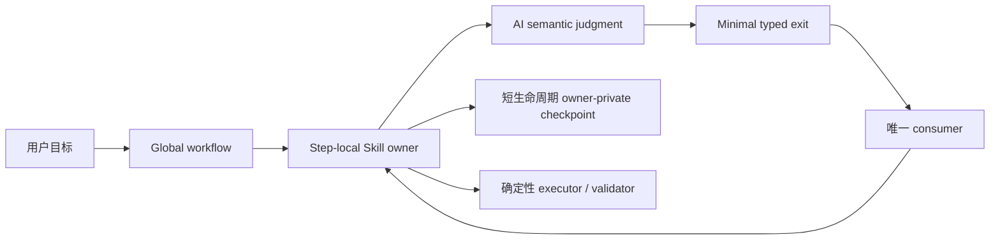
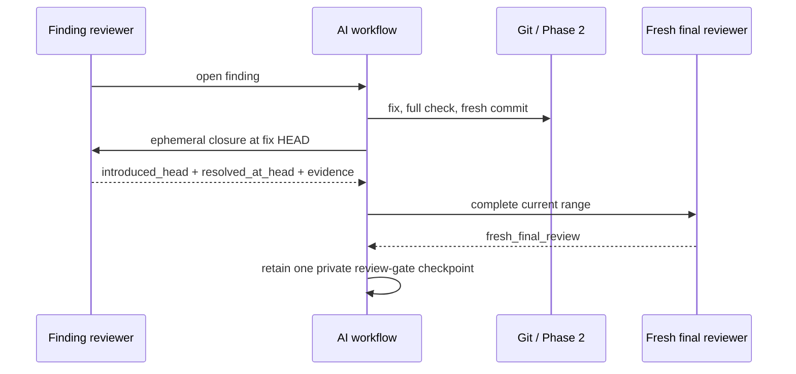

# Guru Team Trellis AI-first 流程说明

本文是非 SSOT 的维护者视图。运行时读取
`trellis/workflows/guru-team/workflow.md` 和
`trellis/skills/guru-team/packages/<skill>/`。

## 核心链路

```mermaid
flowchart LR
  U["用户目标"] --> W["Global workflow"]
  W --> S["Step-local Skill owner"]
  S --> J["AI semantic judgment"]
  J --> D["Minimal typed exit"]
  D --> C["唯一 consumer"]
  C --> S
  S --> P["短生命周期 owner-private checkpoint"]
  S --> R["确定性 executor / validator"]
```

Global workflow 只决定顺序和 consumer；Skill 负责 judgment 与 re-entry；脚本只处理确定性事实。
Routine agent terminal output、Git live facts 和 mapped exits 直接消费，不转写为 handoff、liveness
或逐轮 report。

## Phase 视图

| Phase | 保留的语义 | 正常持久化 |
| --- | --- | --- |
| Intake | base freshness、change context、Intake clarity、scope、workspace authority | 直接 consumer 需要的 task planning / scope evidence |
| Planning | requirement、design、implementation plan、Docs SSOT、AI semantic plan gate | `prd.md`、`design.md`、`implement.md`；owner checkpoint 仅在 ignored runtime |
| Execute | implementation、Phase 2 adequacy、finding、真实 replacement recovery | Phase 2 与异常 recovery checkpoint 均仅在 ignored runtime |
| Finish | exact commit、Branch Review、publication judgment、finalization | `closeout-plan.json`、`finish-summary.json` 与 compact archive |

## Finding Fix 时序

```mermaid
sequenceDiagram
  participant R1 as Finding reviewer
  participant AI as AI workflow
  participant Git as Git / Phase 2
  participant R2 as Fresh final reviewer
  R1->>AI: open finding
  AI->>Git: fix, full check, fresh commit
  AI->>R1: ephemeral closure at fix HEAD
  R1-->>AI: introduced_head + resolved_at_head + evidence
  AI->>R2: complete current range
  R2-->>AI: fresh_final_review
  AI->>AI: retain one private review-gate checkpoint
```

Closure 与 fresh final 是两个语义 judgment，但 closure 没有 public exit 或 artifact。原 reviewer
真实 unfinished 时才由 replacement closure，并留下 ignored recovery checkpoint。新 public input
不接受 `finding_fix_review`；旧 2.0 gate 只读迁移到 `fresh_final_review`。

## 交互预算

一个完整展示且无歧义的 current action 只问 `确认继续`，任意明确肯定回复均有效。内部客观状态
仍绑定 exact target、HEAD、scope、authority 与确有唯一 consumer 的局部事务 identity，但不记录
用户授权。不同副作用目的不合并；只有信息变化或真实选择才再次询问。Mapped exit、stale、
re-entry、reprepare 和 same-plan recovery 自动运行。

## 安装与漂移

Canonical 修改通过 preset 同步到 dogfood、Guru namespace、Codex、Claude 和 Cursor 副本。
验收同时覆盖 clean install、workflow preview/switch、`trellis update` / upgrade、preset reapply、
`.new/.bak`、managed hash、drift 与 all-platform equality。官方 Trellis 管理的文件遵守
`.trellis/.template-hashes.json` 冲突语义；preset 不修改上游 CLI、全局 npm 或 `node_modules`。
